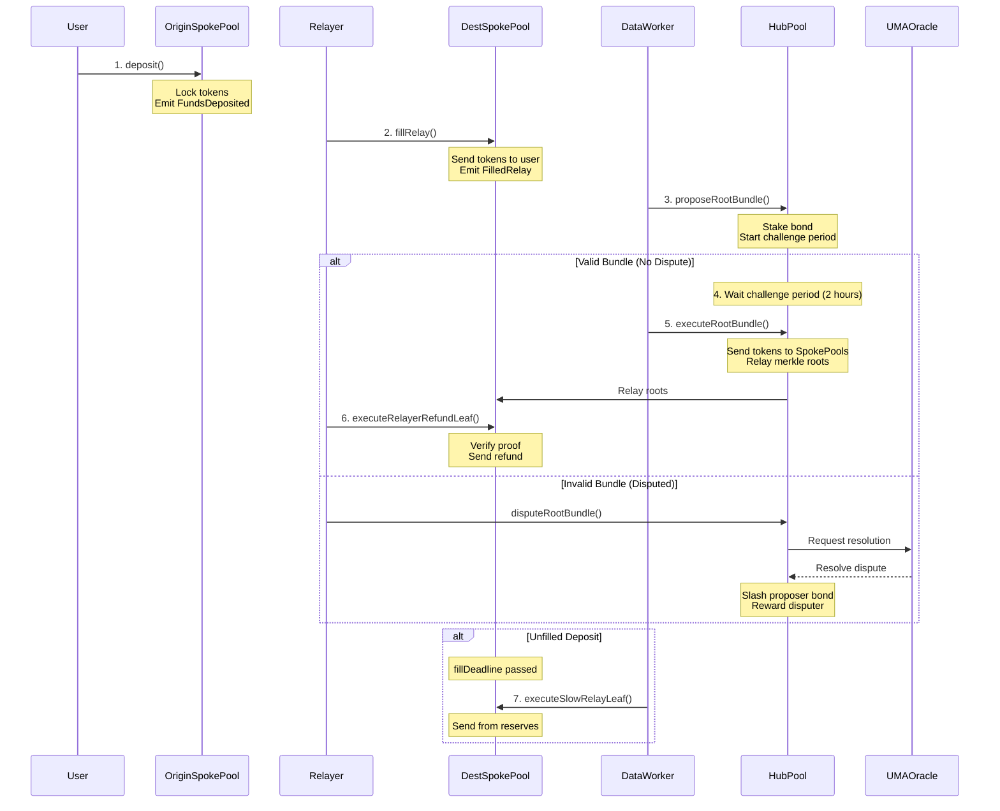

## Overview

The Across Protocol flow consists of seven key stages that enable fast, secure cross-chain token transfers. This guide walks through each stage with code examples and detailed explanations.

<Steps>
  <Step title="Deposit">
    User locks tokens on origin chain and sets relayer fee
  </Step>
  <Step title="Fill">
    Relayer sends tokens to recipient on destination chain
  </Step>
  <Step title="Bundle Proposal">
    Data worker aggregates fills and proposes merkle roots
  </Step>
  <Step title="Challenge Period">
    Bundle open for dispute (default 2 hours)
  </Step>
  <Step title="Execution">
    HubPool sends tokens to SpokePools and relays roots
  </Step>
  <Step title="Refund">
    Relayers claim refunds using merkle proofs
  </Step>
  <Step title="Slow Fill">
    Protocol fills from reserves if no relayer filled
  </Step>
</Steps>

## 1. Deposit

### User Initiates Transfer

A user (depositor) initiates a cross-chain transfer by calling `deposit()` on the origin chain's SpokePool:

<CodeGroup>
```solidity Deposit Function
/**
 * @notice Request to bridge input token cross chain to a destination chain.
 * @dev The hash of the deposit data uniquely identifies this deposit.
 */
function deposit(
    bytes32 depositor,
    bytes32 recipient,
    bytes32 inputToken,
    bytes32 outputToken,
    uint256 inputAmount,
    uint256 outputAmount,
    uint256 destinationChainId,
    bytes32 exclusiveRelayer,
    uint32 quoteTimestamp,
    uint32 fillDeadline,
    uint32 exclusivityParameter,
    bytes calldata message
) public payable override nonReentrant unpausedDeposits {
    // Increment deposit counter for unique ID
    DepositV3Params memory params = DepositV3Params({
        depositor: depositor,
        recipient: recipient,
        inputToken: inputToken,
        outputToken: outputToken,
        inputAmount: inputAmount,
        outputAmount: outputAmount,
        destinationChainId: destinationChainId,
        exclusiveRelayer: exclusiveRelayer,
        depositId: numberOfDeposits++,  // Unique deposit ID
        quoteTimestamp: quoteTimestamp,
        fillDeadline: fillDeadline,
        exclusivityParameter: exclusivityParameter,
        message: message
    });
    _depositV3(params);
}
```

```javascript Example Deposit Call
// User wants to bridge 1000 USDC from Arbitrum to Base
await spokePool.deposit(
  userAddress,           // depositor
  recipientAddress,      // recipient  
  usdcArbitrum,          // inputToken
  usdcBase,              // outputToken
  parseUnits("1000"),    // inputAmount: 1000 USDC
  parseUnits("998"),     // outputAmount: 998 USDC (2 USDC fee)
  8453,                  // destinationChainId: Base
  ethers.ZeroAddress,    // exclusiveRelayer: none
  await getCurrentTime(),// quoteTimestamp: now
  await getCurrentTime() + 7200, // fillDeadline: 2 hours
  0,                     // exclusivityParameter: no exclusivity
  "0x"                   // message: empty
);
```
</CodeGroup>

### What Happens

<AccordionGroup>
  <Accordion title="Token Lock">
    The SpokePool transfers `inputAmount` of `inputToken` from the depositor and locks it in the contract. If the input token is WETH, the user can optionally send native ETH.
  </Accordion>
  
  <Accordion title="Deposit ID Assignment">
    The contract increments `numberOfDeposits` to generate a unique deposit ID. This ID combined with the origin chain ID uniquely identifies the deposit.
  </Accordion>
  
  <Accordion title="Event Emission">
    A `FundsDeposited` event is emitted containing all deposit parameters. Relayers monitor these events to find profitable deposits to fill.
  </Accordion>
  
  <Accordion title="Validation Checks">
    - `quoteTimestamp` must be within `depositQuoteTimeBuffer` of current time
    - `fillDeadline` must be within `fillDeadlineBuffer` of current time
    - `inputAmount` and `outputAmount` must be ≤ `MAX_TRANSFER_SIZE` (1e36)
    - Deposits must not be paused
  </Accordion>
</AccordionGroup>

### Fee Mechanism

The **fee paid to relayers** is captured in the spread between `inputAmount` and `outputAmount`:

```
Relayer Fee = inputAmount - outputAmount (when denominated in same token)
```

**Example:**
- User deposits 1000 USDC on Arbitrum
- User requests 998 USDC on Base
- Relayer earns 2 USDC fee for fulfilling this deposit

The fee must cover:
- Destination chain gas costs
- Relayer's opportunity cost of capital during the optimistic challenge window
- LP fee charged by the protocol
- Relayer's desired profit margin

**Pricing:** Fair pricing is communicated via hosted API services (like Across API) or directly from exclusive relayers.

### Speed Up Deposits

Depositors can reduce the output amount to incentivize faster fills:

<CodeGroup>
```solidity Speed Up Deposit
/**
 * @notice Depositor can signal to relayers to use updated output amount,
 * recipient, and/or message.
 */
function speedUpDeposit(
    bytes32 depositor,
    uint256 depositId,
    uint256 updatedOutputAmount,
    bytes32 updatedRecipient,
    bytes calldata updatedMessage,
    bytes calldata depositorSignature
) public override nonReentrant {
    _verifyUpdateV3DepositMessage(
        depositor.toAddress(),
        depositId,
        chainId(),
        updatedOutputAmount,
        updatedRecipient,
        updatedMessage,
        depositorSignature,
        UPDATE_BYTES32_DEPOSIT_DETAILS_HASH
    );

    emit RequestedSpeedUpDeposit(
        updatedOutputAmount,
        depositId,
        depositor,
        updatedRecipient,
        updatedMessage,
        depositorSignature
    );
}
```
</CodeGroup>

Relayers can optionally use the updated parameters when filling, but are not obligated to.

## 2. Fill

### Relayer Fulfills Deposit

Off-chain relayers monitor `FundsDeposited` events and evaluate profitability. If profitable, they call `fillRelay()` on the destination chain:

<CodeGroup>
```solidity Fill Relay
/**
 * @notice Fills a deposit by sending outputAmount to recipient.
 * @dev Relayer fronts capital and will be refunded via merkle proof later.
 */
function fillRelay(
    bytes32 depositor,
    bytes32 recipient,
    bytes32 inputToken,
    bytes32 outputToken,
    uint256 inputAmount,
    uint256 outputAmount,
    uint256 originChainId,
    uint32 depositId,
    uint32 fillDeadline,
    uint32 exclusivityDeadline,
    bytes calldata message
) external nonReentrant unpausedFills {
    // Validate fill deadline
    require(getCurrentTime() <= fillDeadline, "Fill deadline passed");
    
    // Validate exclusivity
    if (getCurrentTime() < exclusivityDeadline) {
        require(msg.sender == exclusiveRelayer, "Not exclusive relayer");
    }
    
    // Calculate relay hash
    bytes32 relayHash = keccak256(
        abi.encode(
            depositor,
            recipient,
            inputToken,
            outputToken,
            inputAmount,
            outputAmount,
            originChainId,
            depositId,
            fillDeadline,
            exclusivityDeadline,
            message
        )
    );
    
    // Mark as filled
    require(fillStatuses[relayHash] == 0, "Already filled");
    fillStatuses[relayHash] = outputAmount;
    
    // Send tokens to recipient
    IERC20(outputToken).safeTransferFrom(msg.sender, recipient, outputAmount);
    
    emit FilledRelay(
        inputToken,
        outputToken,
        inputAmount,
        outputAmount,
        originChainId,
        depositId,
        fillDeadline,
        exclusivityDeadline,
        msg.sender,
        recipient,
        depositor,
        message
    );
}
```

```javascript Example Fill Call
// Relayer fills the deposit on Base
await spokePool.fillRelay(
  userAddress,           // depositor (from original deposit)
  recipientAddress,      // recipient
  usdcArbitrum,          // inputToken
  usdcBase,              // outputToken
  parseUnits("1000"),    // inputAmount
  parseUnits("998"),     // outputAmount
  42161,                 // originChainId: Arbitrum
  12345,                 // depositId (from FundsDeposited event)
  fillDeadline,          // fillDeadline
  0,                     // exclusivityDeadline: no exclusivity
  "0x"                   // message
);
```
</CodeGroup>

### What Happens

<Steps>
  <Step title="Validation">
    - Check fill deadline hasn't passed
    - Check exclusivity period (if any)
    - Verify deposit hasn't already been filled
  </Step>
  <Step title="Record Fill">
    Calculate relay hash from deposit parameters and mark as filled in `fillStatuses` mapping.
  </Step>
  <Step title="Transfer Tokens">
    Relayer sends `outputAmount` of `outputToken` from their balance to the recipient.
  </Step>
  <Step title="Emit Event">
    `FilledRelay` event emitted for data workers to aggregate.
  </Step>
</Steps>

**Relayer Economics:**
- Relayer fronts `outputAmount` on destination chain
- Relayer receives `inputAmount` refund on their chosen chain
- Net profit = `inputAmount - outputAmount - gasCosts - lpFee`

### Exclusivity Period

Deposits can specify an exclusive relayer and exclusivity deadline:

- **Before exclusivityDeadline**: Only the `exclusiveRelayer` can fill
- **After exclusivityDeadline**: Any relayer can fill

This allows power users to negotiate better pricing with specific relayers.

## 3. Bundle Proposal

### Data Worker Aggregates Activity

Data workers are off-chain agents that:
1. Monitor all SpokePools for `FundsDeposited` and `FilledRelay` events
2. Validate that fills match deposits
3. Calculate net token flows for pool rebalancing
4. Construct three merkle trees
5. Propose a root bundle on the HubPool

<CodeGroup>
```solidity Propose Root Bundle
/**
 * @notice Publish a new root bundle. Caller stakes a bond that can be
 * slashed if the proposal is invalid.
 */
function proposeRootBundle(
    uint256[] calldata bundleEvaluationBlockNumbers,
    uint8 poolRebalanceLeafCount,
    bytes32 poolRebalanceRoot,
    bytes32 relayerRefundRoot,
    bytes32 slowRelayRoot
) public override nonReentrant noActiveRequests unpaused {
    require(poolRebalanceLeafCount > 0, "Bundle must have at least 1 leaf");

    uint32 challengePeriodEndTimestamp = uint32(getCurrentTime()) + liveness;

    // Delete previous bundle (must be fully executed)
    delete rootBundleProposal;

    // Store new bundle
    rootBundleProposal.challengePeriodEndTimestamp = challengePeriodEndTimestamp;
    rootBundleProposal.unclaimedPoolRebalanceLeafCount = poolRebalanceLeafCount;
    rootBundleProposal.poolRebalanceRoot = poolRebalanceRoot;
    rootBundleProposal.relayerRefundRoot = relayerRefundRoot;
    rootBundleProposal.slowRelayRoot = slowRelayRoot;
    rootBundleProposal.proposer = msg.sender;

    // Stake bond
    bondToken.safeTransferFrom(msg.sender, address(this), bondAmount);

    emit ProposeRootBundle(
        challengePeriodEndTimestamp,
        poolRebalanceLeafCount,
        bundleEvaluationBlockNumbers,
        poolRebalanceRoot,
        relayerRefundRoot,
        slowRelayRoot,
        msg.sender
    );
}
```
</CodeGroup>

### Three Merkle Trees

Each root bundle contains three merkle roots:

<CardGroup cols={3}>
  <Card title="Pool Rebalance Root" icon="arrows-rotate">
    Instructions for sending tokens from HubPool to each SpokePool. Each leaf specifies chain, tokens, and amounts.
  </Card>
  <Card title="Relayer Refund Root" icon="receipt">
    Merkle proofs for relayer refunds on each chain. Relayers can claim refunds by providing merkle proofs.
  </Card>
  <Card title="Slow Relay Root" icon="clock">
    Merkle proofs for slow fills. Used when no relayer filled a deposit before the deadline.
  </Card>
</CardGroup>

### Bond Mechanism

Data workers must stake a bond when proposing:

```solidity
// Bond amount calculation
bondAmount = newBondAmount + finalFee;

// finalFee is from UMA's Store contract
// newBondAmount is set by admin (must be >> finalFee)
```

**Bond Outcomes:**
- ✅ **Valid proposal**: Bond returned after all leaves executed
- ❌ **Invalid proposal**: Bond slashed if disputed and UMA oracle confirms invalid

## 4. Challenge Period

### Optimistic Verification Window

After a bundle is proposed, it enters a challenge period (default 2 hours, configurable):

```solidity
challengePeriodEndTimestamp = getCurrentTime() + liveness; // liveness = 7200 (2 hours)
```

During this period:
- ✅ Anyone can dispute the bundle by calling `disputeRootBundle()`
- ✅ Disputer must also stake a bond
- ✅ If disputed, UMA's Optimistic Oracle resolves the dispute
- ❌ Bundle cannot be executed until challenge period ends

### Dispute Process

<CodeGroup>
```solidity Dispute Root Bundle
/**
 * @notice Caller stakes a bond to dispute the current root bundle.
 * Proposal is deleted and dispute sent to optimistic oracle.
 */
function disputeRootBundle() public nonReentrant zeroOptimisticOracleApproval {
    uint32 currentTime = uint32(getCurrentTime());
    require(currentTime <= rootBundleProposal.challengePeriodEndTimestamp, 
            "Request passed liveness");

    uint256 finalFee = _getBondTokenFinalFee();

    // Cancel if finalFee >= bondAmount (would revert in OO)
    if (finalFee >= bondAmount) {
        _cancelBundle();
        return;
    }

    SkinnyOptimisticOracleInterface optimisticOracle = _getOptimisticOracle();

    // Approve bond tokens to OO
    bondToken.safeIncreaseAllowance(address(optimisticOracle), bondAmount);
    
    try optimisticOracle.requestAndProposePriceFor(
        identifier,              // "ACROSS-V2"
        currentTime,
        "",                      // ancillary data
        bondToken,
        0,                       // reward
        bondAmount - finalFee,   // proposer bond
        liveness,
        rootBundleProposal.proposer,
        int256(1e18)            // proposed price: True (valid)
    ) returns (uint256) {
        bondToken.safeApprove(address(optimisticOracle), 0);
    } catch {
        _cancelBundle();
        return;
    }

    // Dispute the price request
    SkinnyOptimisticOracleInterface.Request memory ooPriceRequest = 
        SkinnyOptimisticOracleInterface.Request({
            proposer: rootBundleProposal.proposer,
            disputer: address(0),
            currency: bondToken,
            settled: false,
            proposedPrice: int256(1e18),
            resolvedPrice: 0,
            expirationTime: currentTime + liveness,
            reward: 0,
            finalFee: finalFee,
            bond: bondAmount - finalFee,
            customLiveness: liveness
        });

    delete rootBundleProposal;

    bondToken.safeTransferFrom(msg.sender, address(this), bondAmount);
    bondToken.safeIncreaseAllowance(address(optimisticOracle), bondAmount);
    optimisticOracle.disputePriceFor(
        identifier, 
        currentTime, 
        "", 
        ooPriceRequest, 
        msg.sender, 
        address(this)
    );

    emit RootBundleDisputed(msg.sender, currentTime);
}
```
</CodeGroup>

### UMA Oracle Resolution

If disputed, UMA's Optimistic Oracle resolves:

<Steps>
  <Step title="DVM Vote">
    UMA tokenholders vote on whether the bundle is valid.
  </Step>
  <Step title="Invalid Bundle">
    - Proposer's bond slashed and sent to disputer
    - Disputer receives their bond back plus reward
    - Proposer can submit a corrected bundle
  </Step>
  <Step title="Valid Bundle">
    - Disputer's bond slashed and sent to proposer
    - Proposer receives their bond back plus reward
    - Bundle can be executed after liveness
  </Step>
</Steps>

## 5. Execution

### Execute Root Bundle

After the challenge period passes without dispute, anyone can execute the pool rebalance leaves:

<CodeGroup>
```solidity Execute Root Bundle
/**
 * @notice Executes a pool rebalance leaf. Bridges tokens to SpokePool and
 * relays merkle roots.
 */
function executeRootBundle(
    uint256 chainId,
    uint256 groupIndex,
    uint256[] memory bundleLpFees,
    int256[] memory netSendAmounts,
    int256[] memory runningBalances,
    uint8 leafId,
    address[] memory l1Tokens,
    bytes32[] calldata proof
) public nonReentrant unpaused {
    require(getCurrentTime() > rootBundleProposal.challengePeriodEndTimestamp, 
            "Not passed liveness");
    require(!MerkleLib.isClaimed1D(rootBundleProposal.claimedBitMap, leafId), 
            "Already claimed");

    // Verify merkle proof
    require(
        MerkleLib.verifyPoolRebalance(
            rootBundleProposal.poolRebalanceRoot,
            PoolRebalanceLeaf({
                chainId: chainId,
                groupIndex: groupIndex,
                bundleLpFees: bundleLpFees,
                netSendAmounts: netSendAmounts,
                runningBalances: runningBalances,
                leafId: leafId,
                l1Tokens: l1Tokens
            }),
            proof
        ),
        "Bad Proof"
    );

    (address adapter, address spokePool) = _getInitializedCrossChainContracts(chainId);

    // Mark leaf as claimed
    rootBundleProposal.claimedBitMap = MerkleLib.setClaimed1D(
        rootBundleProposal.claimedBitMap, 
        leafId
    );
    --rootBundleProposal.unclaimedPoolRebalanceLeafCount;

    // Send tokens to SpokePool via adapter
    _sendTokensToChainAndUpdatePooledTokenTrackers(
        adapter,
        spokePool,
        chainId,
        l1Tokens,
        netSendAmounts,
        bundleLpFees
    );

    // Relay merkle roots to SpokePool (only for groupIndex == 0)
    if (groupIndex == 0) {
        (bool success, ) = adapter.delegatecall(
            abi.encodeWithSignature(
                "relayMessage(address,bytes)",
                spokePool,
                abi.encodeWithSignature(
                    "relayRootBundle(bytes32,bytes32)",
                    rootBundleProposal.relayerRefundRoot,
                    rootBundleProposal.slowRelayRoot
                )
            )
        );
        require(success, "delegatecall failed");
    }

    // Return bond if all leaves executed
    if (rootBundleProposal.unclaimedPoolRebalanceLeafCount == 0)
        bondToken.safeTransfer(rootBundleProposal.proposer, bondAmount);

    emit RootBundleExecuted(
        groupIndex, leafId, chainId, l1Tokens, 
        bundleLpFees, netSendAmounts, runningBalances, msg.sender
    );
}
```
</CodeGroup>

### What Happens

<Steps>
  <Step title="Verify Liveness">
    Check that challenge period has ended.
  </Step>
  <Step title="Verify Merkle Proof">
    Validate that the provided leaf and proof match the pool rebalance root.
  </Step>
  <Step title="Send Tokens">
    Bridge tokens from HubPool to SpokePool using the chain adapter.
  </Step>
  <Step title="Relay Roots">
    Send relayer refund and slow relay roots to the SpokePool (if groupIndex == 0).
  </Step>
  <Step title="Return Bond">
    Return proposer's bond after all leaves executed.
  </Step>
</Steps>

### Pool Rebalancing

Tokens are sent from HubPool to SpokePools:

```solidity
// Positive netSendAmount: Send tokens to SpokePool
if (netSendAmounts[i] > 0) {
    (bool success, ) = adapter.delegatecall(
        abi.encodeWithSignature(
            "relayTokens(address,address,uint256,address)",
            l1Token,
            l2Token,
            uint256(netSendAmounts[i]),
            spokePool
        )
    );
    require(success, "delegatecall failed");
    
    pooledTokens[l1Token].utilizedReserves += netSendAmounts[i];
    pooledTokens[l1Token].liquidReserves -= uint256(netSendAmounts[i]);
}
```

## 6. Refund

### Relayers Claim Refunds

After roots are relayed to SpokePools, relayers can claim refunds:

<CodeGroup>
```solidity Execute Relayer Refund Leaf
/**
 * @notice Executes a relayer refund leaf using merkle proof.
 */
function executeRelayerRefundLeaf(
    uint32 rootBundleId,
    RelayerRefundLeaf memory relayerRefundLeaf,
    bytes32[] memory proof
) public nonReentrant {
    // Verify merkle proof
    require(
        MerkleLib.verifyRelayerRefund(
            rootBundles[rootBundleId].relayerRefundRoot,
            relayerRefundLeaf,
            proof
        ),
        "Bad Proof"
    );

    // Mark leaf as claimed
    require(
        !MerkleLib.isClaimed2D(
            rootBundles[rootBundleId].claimedBitmap,
            relayerRefundLeaf.leafId
        ),
        "Already claimed"
    );
    rootBundles[rootBundleId].claimedBitmap = MerkleLib.setClaimed2D(
        rootBundles[rootBundleId].claimedBitmap,
        relayerRefundLeaf.leafId
    );

    // Send refunds to relayers
    for (uint256 i = 0; i < relayerRefundLeaf.refundAddresses.length; i++) {
        IERC20(relayerRefundLeaf.l2TokenAddress).safeTransfer(
            relayerRefundLeaf.refundAddresses[i],
            relayerRefundLeaf.refundAmounts[i]
        );
    }

    emit ExecutedRelayerRefundRoot(
        relayerRefundLeaf.amountToReturn,
        relayerRefundLeaf.chainId,
        relayerRefundLeaf.refundAmounts,
        rootBundleId,
        relayerRefundLeaf.leafId,
        relayerRefundLeaf.l2TokenAddress,
        relayerRefundLeaf.refundAddresses,
        msg.sender
    );
}
```
</CodeGroup>

### Refund Calculation

Relayer refunds account for:

```
Refund = inputAmount - lpFee - protocolFee
```

Where:
- **inputAmount**: Original deposit amount
- **lpFee**: Fee paid to LPs for providing liquidity
- **protocolFee**: Fee captured by the protocol

## 7. Slow Fill

### Fallback for Unfilled Deposits

If no relayer fills a deposit before the `fillDeadline`, the protocol can fulfill it using a slow fill:

<CodeGroup>
```solidity Execute Slow Relay Leaf
/**
 * @notice Executes a slow relay leaf using merkle proof.
 * Sends tokens from SpokePool reserves to recipient.
 */
function executeSlowRelayLeaf(
    uint32 rootBundleId,
    SlowRelayLeaf memory slowRelayLeaf,
    bytes32[] memory proof
) public nonReentrant {
    // Verify merkle proof
    require(
        MerkleLib.verifySlowRelay(
            rootBundles[rootBundleId].slowRelayRoot,
            slowRelayLeaf,
            proof
        ),
        "Bad Proof"
    );

    // Mark leaf as claimed
    require(
        !MerkleLib.isClaimed2D(
            rootBundles[rootBundleId].claimedBitmap,
            slowRelayLeaf.leafId
        ),
        "Already claimed"
    );
    rootBundles[rootBundleId].claimedBitmap = MerkleLib.setClaimed2D(
        rootBundles[rootBundleId].claimedBitmap,
        slowRelayLeaf.leafId
    );

    // Send tokens from SpokePool reserves to recipient
    IERC20(slowRelayLeaf.outputToken).safeTransfer(
        slowRelayLeaf.recipient,
        slowRelayLeaf.outputAmount
    );

    emit ExecutedSlowRelay(
        slowRelayLeaf.depositor,
        slowRelayLeaf.recipient,
        slowRelayLeaf.inputToken,
        slowRelayLeaf.outputToken,
        slowRelayLeaf.inputAmount,
        slowRelayLeaf.outputAmount,
        slowRelayLeaf.originChainId,
        slowRelayLeaf.depositId,
        slowRelayLeaf.fillDeadline,
        msg.sender
    );
}
```
</CodeGroup>

### Slow Fill Characteristics

<CardGroup cols={2}>
  <Card title="No Relayer" icon="user-slash">
    No relayer is credited with a refund for slow fills. The protocol fulfills from SpokePool reserves.
  </Card>
  <Card title="No Fee" icon="coins">
    Slow fills use `outputAmount` equal to `inputAmount`, meaning no fee is charged.
  </Card>
  <Card title="Guaranteed Delivery" icon="shield-check">
    Users are guaranteed to receive their funds even if no relayer fills.
  </Card>
  <Card title="Slower" icon="clock">
    Slow fills only occur after the optimistic challenge window, typically 2+ hours.
  </Card>
</CardGroup>

## Complete Flow Diagram



## Related Documentation

<CardGroup cols={3}>
  <Card title="Architecture" icon="diagram-project" href="/concepts/architecture">
    System architecture overview
  </Card>
  <Card title="Hub-and-Spoke" icon="network-wired" href="/concepts/hub-and-spoke">
    Hub-and-spoke model details
  </Card>
  <Card title="Roles" icon="users" href="/concepts/roles">
    Participant roles and responsibilities
  </Card>
</CardGroup>
