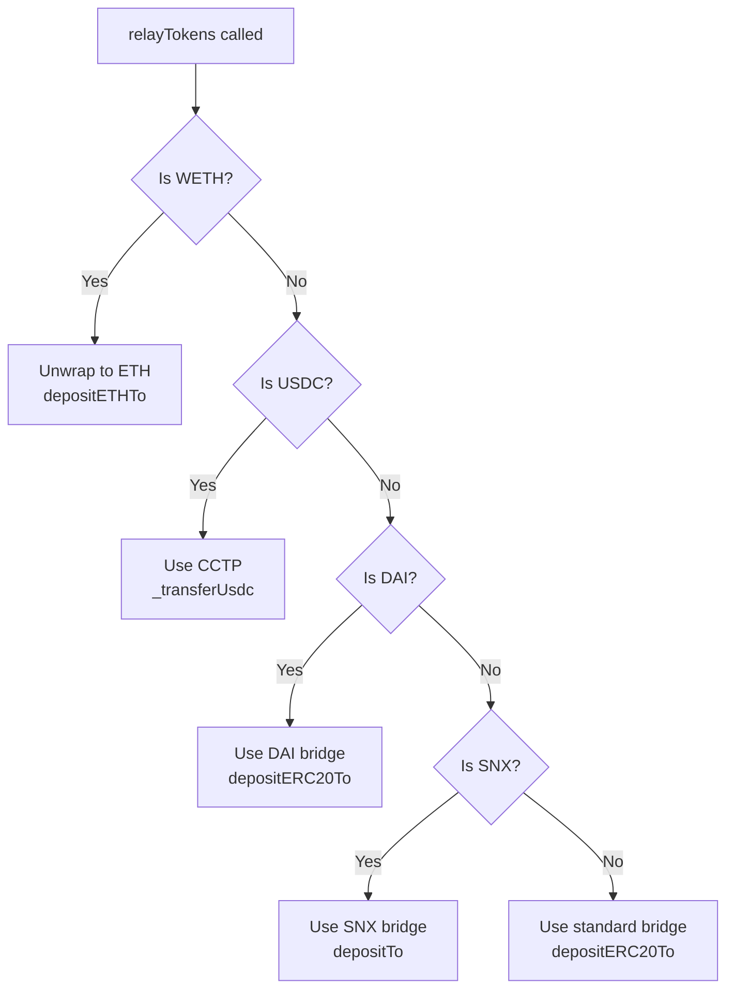

## Overview

Across Protocol provides two adapters for OP Stack chains:

1. **`Optimism_Adapter`** - Legacy adapter for Optimism mainnet with custom bridge support
2. **`OP_Adapter`** - Modern adapter for all OP Stack chains (Base, Mode, Zora, etc.)

Both adapters use the OP Stack's [CrossDomainMessenger](https://docs.optimism.io/builders/app-developers/bridging/messaging) system to send messages and tokens from L1 to L2.

## Optimism_Adapter

### Overview

The original adapter for Optimism mainnet with support for custom token bridges (DAI, SNX).

**Location**: `contracts/chain-adapters/Optimism_Adapter.sol`

### Constructor

```solidity
constructor(
    WETH9Interface _l1Weth,
    address _crossDomainMessenger,
    IL1StandardBridge _l1StandardBridge,
    IERC20 _l1Usdc,
    ITokenMessenger _cctpTokenMessenger
)
```

**Parameters**:
- `_l1Weth` - WETH contract on L1 (unwrapped before bridging)
- `_crossDomainMessenger` - L1CrossDomainMessenger system contract
- `_l1StandardBridge` - L1StandardBridge for token transfers
- `_l1Usdc` - USDC token address for CCTP bridging
- `_cctpTokenMessenger` - Circle CCTP TokenMessenger contract

### Constants

```solidity
uint32 public constant L2_GAS_LIMIT = 200_000;

// Custom bridge addresses
address public constant DAI = 0x6B175474E89094C44Da98b954EedeAC495271d0F;
address public constant DAI_OPTIMISM_BRIDGE = 0x10E6593CDda8c58a1d0f14C5164B376352a55f2F;
address public constant SNX = 0xC011a73ee8576Fb46F5E1c5751cA3B9Fe0af2a6F;
address public constant SNX_OPTIMISM_BRIDGE = 0x39Ea01a0298C315d149a490E34B59Dbf2EC7e48F;
```

### Core Functions

#### relayMessage()

Sends cross-chain messages via the CrossDomainMessenger.

```solidity
function relayMessage(address target, bytes calldata message) external payable override {
    sendCrossDomainMessage(target, L2_GAS_LIMIT, message);
    emit MessageRelayed(target, message);
}

// Inherited from CrossDomainEnabled
function sendCrossDomainMessage(
    address _crossDomainTarget,
    uint32 _gasLimit,
    bytes calldata _message
) internal {
    getCrossDomainMessenger().sendMessage(_crossDomainTarget, _message, _gasLimit);
}
```

**Key Points**:
- Uses `CrossDomainEnabled` helper contract
- Messages are sent to target contract on L2
- Gas limit is fixed at 200,000
- No ETH is sent to target (msg.value is for gas only)

#### relayTokens()

Bridges tokens to Optimism with multi-bridge support.

```solidity
function relayTokens(
    address l1Token,
    address l2Token,
    uint256 amount,
    address to
) external payable override {
    // 1. WETH: Unwrap and send native ETH
    if (l1Token == address(L1_WETH)) {
        L1_WETH.withdraw(amount);
        L1_STANDARD_BRIDGE.depositETHTo{ value: amount }(to, L2_GAS_LIMIT, "");
    }
    // 2. USDC: Use Circle CCTP
    else if (_isCCTPEnabled() && l1Token == address(usdcToken)) {
        _transferUsdc(to, amount);
    }
    // 3. Custom bridges for DAI and SNX
    else {
        address bridgeToUse = address(L1_STANDARD_BRIDGE);

        if (l1Token == DAI) bridgeToUse = DAI_OPTIMISM_BRIDGE;
        if (l1Token == SNX) bridgeToUse = SNX_OPTIMISM_BRIDGE;

        IERC20(l1Token).safeIncreaseAllowance(bridgeToUse, amount);
        
        // SNX has custom bridge interface
        if (l1Token == SNX) {
            SynthetixBridgeToOptimism(bridgeToUse).depositTo(to, amount);
        } else {
            IL1StandardBridge(bridgeToUse).depositERC20To(
                l1Token,
                l2Token,
                to,
                amount,
                L2_GAS_LIMIT,
                ""
            );
        }
    }
    emit TokensRelayed(l1Token, l2Token, amount, to);
}
```

### Custom Token Bridges

#### DAI Bridge

**L1 Address**: `0x10E6593CDda8c58a1d0f14C5164B376352a55f2F`

DAI uses MakerDAO's custom bridge instead of the standard bridge.

```solidity
if (l1Token == DAI) bridgeToUse = DAI_OPTIMISM_BRIDGE;
```

#### Synthetix (SNX) Bridge

**L1 Address**: `0x39Ea01a0298C315d149a490E34B59Dbf2EC7e48F`

SNX uses Synthetix's custom bridge with a different interface:

```solidity
interface SynthetixBridgeToOptimism is IL1StandardBridge {
    function depositTo(address to, uint256 amount) external;
}
```

### Bridge Selection Logic



---

## OP_Adapter

### Overview

Modern adapter for all OP Stack chains including Base, Mode, Zora, Lisk, and others. Supports both bridged USDC (via OP USDC Bridge) and native USDC (via CCTP).

**Location**: `contracts/chain-adapters/OP_Adapter.sol`

### Constructor

```solidity
constructor(
    WETH9Interface _l1Weth,
    IERC20 _l1Usdc,
    address _crossDomainMessenger,
    IL1StandardBridge _l1StandardBridge,
    IOpUSDCBridgeAdapter _l1USDCBridge,
    ITokenMessenger _cctpTokenMessenger,
    uint32 _recipientCircleDomainId
)
```

**Parameters**:
- `_l1Weth` - WETH contract on L1
- `_l1Usdc` - USDC token address on L1
- `_crossDomainMessenger` - L1CrossDomainMessenger for the target OP Stack chain
- `_l1StandardBridge` - L1StandardBridge for the target chain
- `_l1USDCBridge` - OP USDC Bridge adapter (for bridged USDC) or `address(0)`
- `_cctpTokenMessenger` - CCTP TokenMessenger (for native USDC) or `address(0)`
- `_recipientCircleDomainId` - Circle domain ID for the destination chain

**Bridge Configuration Validation**:
```solidity
if (address(_l1Usdc) != zero) {
    bool opUSDCBridgeDisabled = address(_l1USDCBridge) == zero;
    bool cctpUSDCBridgeDisabled = address(_cctpTokenMessenger) == zero;
    // Bridged and Native USDC are mutually exclusive
    if (opUSDCBridgeDisabled == cctpUSDCBridgeDisabled) {
        revert InvalidBridgeConfig();
    }
}
```

Either OP USDC Bridge OR CCTP must be configured, but not both.

### Core Functions

#### relayMessage()

Identical to `Optimism_Adapter`:

```solidity
function relayMessage(address target, bytes calldata message) external payable override {
    sendCrossDomainMessage(target, L2_GAS_LIMIT, message);
    emit MessageRelayed(target, message);
}
```

#### relayTokens()

Supports WETH, USDC (bridged or native), and standard ERC20s:

```solidity
function relayTokens(
    address l1Token,
    address l2Token,
    uint256 amount,
    address to
) external payable override {
    // 1. WETH: Unwrap to ETH
    if (l1Token == address(L1_WETH)) {
        L1_WETH.withdraw(amount);
        L1_STANDARD_BRIDGE.depositETHTo{ value: amount }(to, L2_GAS_LIMIT, "");
    }
    // 2. USDC: Use CCTP or OP USDC Bridge
    else if (l1Token == address(usdcToken)) {
        if (_isCCTPEnabled()) {
            // Native USDC via CCTP
            _transferUsdc(to, amount);
        } else {
            // Bridged USDC via OP USDC Bridge
            IERC20(l1Token).safeIncreaseAllowance(address(L1_OP_USDC_BRIDGE), amount);
            L1_OP_USDC_BRIDGE.sendMessage(to, amount, L2_GAS_LIMIT);
        }
    }
    // 3. Standard ERC20 tokens
    else {
        IERC20(l1Token).safeIncreaseAllowance(address(L1_STANDARD_BRIDGE), amount);
        L1_STANDARD_BRIDGE.depositERC20To(l1Token, l2Token, to, amount, L2_GAS_LIMIT, "");
    }
    emit TokensRelayed(l1Token, l2Token, amount, to);
}
```

### OP USDC Bridge

Some OP Stack chains use bridged USDC instead of native USDC.

**Interface**:
```solidity
interface IOpUSDCBridgeAdapter {
    function sendMessage(
        address to,
        uint256 amount,
        uint32 minGasLimit
    ) external;
}
```

**Example chains using bridged USDC**:
- Base (transitioning to native)
- Mode
- Zora

---

## CrossDomainEnabled

Both adapters inherit from `CrossDomainEnabled`, a modified version of Optimism's helper contract with immutable state variables for delegatecall compatibility.

**Location**: `contracts/chain-adapters/CrossDomainEnabled.sol`

```solidity
contract CrossDomainEnabled {
    // Immutable for delegatecall compatibility
    address public immutable MESSENGER;

    constructor(address _messenger) {
        MESSENGER = _messenger;
    }

    function getCrossDomainMessenger() internal virtual returns (ICrossDomainMessenger) {
        return ICrossDomainMessenger(MESSENGER);
    }

    function sendCrossDomainMessage(
        address _crossDomainTarget,
        uint32 _gasLimit,
        bytes calldata _message
    ) internal {
        getCrossDomainMessenger().sendMessage(_crossDomainTarget, _message, _gasLimit);
    }
}
```

**Why Immutable?**

Since adapters are called via delegatecall from HubPool, storage variables would read HubPool's storage slots. Immutable variables are embedded in bytecode and work correctly in delegatecall contexts.

## CrossDomainMessenger Interface

```solidity
interface ICrossDomainMessenger {
    function sendMessage(
        address _target,
        bytes calldata _message,
        uint32 _minGasLimit
    ) external payable;
    
    function xDomainMessageSender() external view returns (address);
}
```

**Key Methods**:
- `sendMessage()` - Sends message from L1 to L2
- `xDomainMessageSender()` - Returns original L1 sender (used by SpokePool to verify admin)

## Admin Verification on L2

OP Stack SpokePools verify admin messages using `xDomainMessageSender()`:

```solidity
// In Optimism_SpokePool.sol
function _requireAdminSender() internal view override {
    require(
        msg.sender == address(MESSENGER) &&
        MESSENGER.xDomainMessageSender() == hubPool,
        "Only HubPool via messenger"
    );
}
```

**Verification Steps**:
1. Message sender must be the CrossDomainMessenger contract
2. The cross-domain sender must be the HubPool address

## Supported Chains

### Optimism_Adapter
- Optimism (Chain ID: 10)

### OP_Adapter
- Base (Chain ID: 8453)
- Mode (Chain ID: 34443)
- Lisk (Chain ID: 1135)
- Zora (Chain ID: 7777777)
- Blast (uses custom `Blast_Adapter` variant)
- And other OP Stack chains

## Gas Considerations

### Fixed Gas Limit

Both adapters use a fixed L2 gas limit of 200,000:

```solidity
uint32 public constant L2_GAS_LIMIT = 200_000;
```

This is sufficient for:
- Token transfers via standard bridge
- Admin function calls to SpokePool
- CCTP transfers

### No ETH Balance Check

Unlike Arbitrum adapter, OP adapters don't require pre-funding ETH. The `msg.value` sent with the transaction covers L2 gas costs.

## Examples

### Relay Admin Message to Base SpokePool

```solidity
// On HubPool using OP_Adapter for Base
bytes memory functionData = abi.encodeCall(
    SpokePool.setEnableRoute,
    (originToken, destinationChainId, enabled)
);

hubPool.relaySpokePoolAdminFunction(
    8453,  // Base chain ID
    functionData
);
```

### Bridge WETH to Optimism

```solidity
// WETH is automatically unwrapped to ETH and bridged
hubPool.relayTokens(
    WETH_L1,
    WETH_OPTIMISM,  // Actually receives ETH on L2
    10 ether,
    spokePoolAddress
);
```

### Bridge USDC to Base (Bridged USDC)

```solidity
// Uses OP USDC Bridge if CCTP is not enabled
hubPool.relayTokens(
    USDC_L1,
    USDC_BASE_BRIDGED,
    5000e6,  // 5000 USDC
    spokePoolAddress
);
```

## Related Contracts

- `Optimism_SpokePool.sol` - SpokePool for Optimism mainnet
- `Base_Adapter.sol` - Specialized adapter for Base (if different)
- `Mode_Adapter.sol` - Specialized adapter for Mode (if different)
- `Blast_Adapter.sol` - Custom adapter for Blast with yield features

## Source Code

- [Optimism_Adapter.sol](https://github.com/across-protocol/contracts/blob/master/contracts/chain-adapters/Optimism_Adapter.sol)
- [OP_Adapter.sol](https://github.com/across-protocol/contracts/blob/master/contracts/chain-adapters/OP_Adapter.sol)
- [CrossDomainEnabled.sol](https://github.com/across-protocol/contracts/blob/master/contracts/chain-adapters/CrossDomainEnabled.sol)