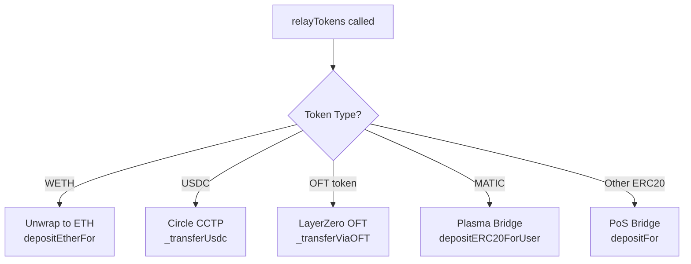

## Overview

The `Polygon_Adapter` enables the HubPool to bridge tokens and send messages from Ethereum L1 to Polygon PoS (formerly Matic Network) using Polygon's native bridge infrastructure.

## Key Features

- **FxPortal Messaging**: Sends arbitrary messages via `FxStateSender`
- **Dual Token Bridges**: 
  - **PoS Bridge** (RootChainManager) for most ERC20 tokens
  - **Plasma Bridge** (DepositManager) for MATIC token
- **Multiple Bridge Support**: CCTP for USDC, LayerZero OFT for omnichain tokens
- **ETH Handling**: Unwraps WETH to native ETH before bridging

## Contract Reference

**Location**: `contracts/chain-adapters/Polygon_Adapter.sol`

### Constructor

```solidity
constructor(
    IRootChainManager _rootChainManager,
    IFxStateSender _fxStateSender,
    DepositManager _depositManager,
    address _erc20Predicate,
    address _l1Matic,
    WETH9Interface _l1Weth,
    IERC20 _l1Usdc,
    ITokenMessenger _cctpTokenMessenger,
    address _adapterStore,
    uint32 _oftDstEid,
    uint256 _oftFeeCap
)
```

**Parameters**:
- `_rootChainManager` - RootChainManager contract for PoS bridge token deposits
- `_fxStateSender` - FxStateSender contract for sending arbitrary messages
- `_depositManager` - DepositManager contract for Plasma bridge (MATIC deposits)
- `_erc20Predicate` - ERC20Predicate contract to approve for PoS bridge
- `_l1Matic` - MATIC token address on L1
- `_l1Weth` - WETH token address on L1
- `_l1Usdc` - USDC token address for CCTP bridging
- `_cctpTokenMessenger` - Circle CCTP TokenMessenger contract
- `_adapterStore` - Storage contract for OFT bridging support
- `_oftDstEid` - LayerZero endpoint ID for Polygon (30109)
- `_oftFeeCap` - Maximum fee cap for OFT bridging (e.g., 1 ether)

### Immutable Variables

```solidity
IRootChainManager public immutable ROOT_CHAIN_MANAGER;
IFxStateSender public immutable FX_STATE_SENDER;
DepositManager public immutable DEPOSIT_MANAGER;
address public immutable ERC20_PREDICATE;
address public immutable L1_MATIC;
WETH9Interface public immutable L1_WETH;
```

## Core Functions

### relayMessage()

Sends arbitrary messages from L1 to Polygon via the FxPortal system.

```solidity
function relayMessage(address target, bytes calldata message) external payable override {
    FX_STATE_SENDER.sendMessageToChild(target, message);
    emit MessageRelayed(target, message);
}
```

**How it works**:
1. `FxStateSender` emits a `StateSynced` event on L1
2. Polygon validators include this state sync in a checkpoint
3. `FxChild` contract on Polygon receives and processes the message
4. Message is forwarded to the `target` contract (usually Polygon SpokePool)

**Gas**: No L1 gas fee required (validators process state syncs automatically)

**Latency**: ~20-30 minutes (checkpoint finalization time)

### relayTokens()

Bridges tokens from L1 to Polygon using the appropriate bridge.

```solidity
function relayTokens(
    address l1Token,
    address l2Token,
    uint256 amount,
    address to
) external payable override {
    address oftMessenger = _getOftMessenger(l1Token);

    // 1. WETH: Unwrap and bridge native ETH
    if (l1Token == address(L1_WETH)) {
        L1_WETH.withdraw(amount);
        ROOT_CHAIN_MANAGER.depositEtherFor{ value: amount }(to);
    }
    // 2. USDC: Use Circle CCTP
    else if (_isCCTPEnabled() && l1Token == address(usdcToken)) {
        _transferUsdc(to, amount);
    }
    // 3. OFT tokens: Use LayerZero
    else if (oftMessenger != address(0)) {
        _transferViaOFT(IERC20(l1Token), IOFT(oftMessenger), to, amount);
    }
    // 4. MATIC: Use Plasma bridge
    else if (l1Token == L1_MATIC) {
        IERC20(l1Token).safeIncreaseAllowance(address(DEPOSIT_MANAGER), amount);
        DEPOSIT_MANAGER.depositERC20ForUser(l1Token, to, amount);
    }
    // 5. Other ERC20s: Use PoS bridge
    else {
        IERC20(l1Token).safeIncreaseAllowance(ERC20_PREDICATE, amount);
        ROOT_CHAIN_MANAGER.depositFor(to, l1Token, abi.encode(amount));
    }
    emit TokensRelayed(l1Token, l2Token, amount, to);
}
```

## Bridge Selection Logic



## FxPortal System

### Overview

FxPortal is Polygon's arbitrary message passing system between L1 and L2.

**L1 Component**: `FxStateSender`
**L2 Component**: `FxChild`

### FxStateSender Interface

```solidity
interface IFxStateSender {
    /**
     * @notice Send arbitrary message to Polygon.
     * @param _receiver Address on Polygon to receive message.
     * @param _data Message to send to _receiver on Polygon.
     */
    function sendMessageToChild(address _receiver, bytes calldata _data) external;
}
```

**Mainnet Address**: `0xfe5e5D361b2ad62c541bAb87C45a0B9B018389a2`

### Message Flow

1. **L1**: `FxStateSender.sendMessageToChild(receiver, data)` emits `StateSynced` event
2. **Validators**: Include state sync in next checkpoint (~20-30 min)
3. **L2**: `FxChild` contract receives and validates state sync
4. **L2**: `FxChild` forwards message to `receiver.processMessageFromRoot(data)`

### Polygon SpokePool Integration

```solidity
// In Polygon_SpokePool.sol
function processMessageFromRoot(
    uint256 /* stateId */,
    address rootMessageSender,
    bytes calldata data
) external {
    require(msg.sender == address(FX_CHILD), "Only FxChild");
    require(rootMessageSender == hubPool, "Only HubPool");
    
    // Execute admin function
    (bool success, ) = address(this).call(data);
    require(success, "Call failed");
}
```

## RootChainManager (PoS Bridge)

### Overview

The PoS (Proof of Stake) bridge is Polygon's main token bridge for ERC20 tokens.

**Mainnet Address**: `0xA0c68C638235ee32657e8f720a23ceC1bFc77C77`

### Interface

```solidity
interface IRootChainManager {
    /**
     * @notice Send msg.value of ETH to Polygon
     * @param user Recipient of ETH on Polygon.
     */
    function depositEtherFor(address user) external payable;

    /**
     * @notice Send ERC20 tokens to Polygon.
     * @param user Recipient of L2 equivalent tokens on Polygon.
     * @param rootToken L1 Address of token to send.
     * @param depositData Data to pass to L2 including amount. Should be abi.encode(amount).
     */
    function depositFor(
        address user,
        address rootToken,
        bytes calldata depositData
    ) external;
}
```

### Token Approval

Tokens must be approved to the **ERC20Predicate** contract, not RootChainManager:

```solidity
IERC20(l1Token).safeIncreaseAllowance(ERC20_PREDICATE, amount);
ROOT_CHAIN_MANAGER.depositFor(to, l1Token, abi.encode(amount));
```

**ERC20Predicate Address**: `0x40ec5B33f54e0E8A33A975908C5BA1c14e5BbbDf`

### How PoS Bridge Works

1. **L1**: User locks tokens in Predicate contract
2. **L1**: RootChainManager emits deposit event
3. **Validators**: Include deposit in checkpoint
4. **L2**: ChildChainManager mints equivalent L2 tokens to recipient

**Finality**: ~20-30 minutes (checkpoint submission)

## DepositManager (Plasma Bridge)

### Overview

The Plasma bridge is used exclusively for MATIC token deposits. It's the legacy bridge system that predates the PoS bridge.

**Mainnet Address**: `0x401F6c983eA34274ec46f84D70b31C151321188b`

### Interface

```solidity
interface DepositManager {
    /**
     * @notice Send tokens to Polygon. Only used to send MATIC.
     * @param token L1 token to send. Should be MATIC.
     * @param user Recipient of L2 equivalent tokens on Polygon.
     * @param amount Amount of token to send.
     */
    function depositERC20ForUser(address token, address user, uint256 amount) external;
}
```

### Why Separate Bridge for MATIC?

MATIC uses the Plasma bridge instead of PoS bridge for historical reasons and because it's the native gas token on Polygon.

```solidity
if (l1Token == L1_MATIC) {
    IERC20(l1Token).safeIncreaseAllowance(address(DEPOSIT_MANAGER), amount);
    DEPOSIT_MANAGER.depositERC20ForUser(l1Token, to, amount);
}
```

**L1 MATIC Address**: `0x7D1AfA7B718fb893dB30A3aBc0Cfc608AaCfeBB0`

## CCTP Integration

For USDC, the adapter uses Circle's Cross-Chain Transfer Protocol (CCTP) for native USDC bridging:

```solidity
else if (_isCCTPEnabled() && l1Token == address(usdcToken)) {
    _transferUsdc(to, amount);
}
```

**Advantages of CCTP**:
- Native USDC on both chains (no wrapped tokens)
- Faster finality than native bridges
- Lower fees

**Circle Domain ID for Polygon**: 7

## LayerZero OFT Support

The adapter supports omnichain fungible tokens (OFT) via LayerZero:

```solidity
address oftMessenger = _getOftMessenger(l1Token);
if (oftMessenger != address(0)) {
    _transferViaOFT(IERC20(l1Token), IOFT(oftMessenger), to, amount);
}
```

**LayerZero Endpoint ID**: 30109 (Polygon mainnet)

**OFT Configuration**: Stored in `AdapterStore` contract, managed by HubPool admin

## Examples

### Send Admin Message to Polygon SpokePool

```solidity
// On HubPool
bytes memory functionData = abi.encodeCall(
    SpokePool.setEnableRoute,
    (originToken, destinationChainId, enabled)
);

hubPool.relaySpokePoolAdminFunction(
    137,  // Polygon chain ID
    functionData
);

// Internally calls:
// Polygon_Adapter.relayMessage(spokePoolAddress, functionData)
// -> FX_STATE_SENDER.sendMessageToChild(spokePoolAddress, functionData)
```

### Bridge WETH to Polygon

```solidity
// WETH is unwrapped and bridged as native ETH
hubPool.relayTokens(
    WETH_L1,
    WETH_POLYGON,  // Receives ETH on Polygon, wrapped by recipient
    5 ether,
    spokePoolAddress
);

// Internally:
// 1. L1_WETH.withdraw(5 ether) -> converts WETH to ETH
// 2. ROOT_CHAIN_MANAGER.depositEtherFor{value: 5 ether}(spokePoolAddress)
```

### Bridge USDC via CCTP

```solidity
// USDC uses Circle CCTP automatically
hubPool.relayTokens(
    USDC_L1,
    USDC_POLYGON,
    10000e6,  // 10,000 USDC
    spokePoolAddress
);

// Uses Circle's TokenMessenger for native USDC
```

### Bridge MATIC Token

```solidity
// MATIC uses Plasma bridge
hubPool.relayTokens(
    MATIC_L1,  // 0x7D1AfA7B718fb893dB30A3aBc0Cfc608AaCfeBB0
    MATIC_POLYGON,  // Native token on Polygon
    1000 ether,
    spokePoolAddress
);

// Uses DepositManager.depositERC20ForUser()
```

### Bridge Standard ERC20

```solidity
// Example: USDT (not using CCTP)
hubPool.relayTokens(
    USDT_L1,
    USDT_POLYGON,
    5000e6,
    spokePoolAddress
);

// Uses RootChainManager PoS bridge
// Approves ERC20_PREDICATE, calls ROOT_CHAIN_MANAGER.depositFor()
```

## Gas Considerations

### No L2 Gas Payment Required

Unlike Arbitrum or OP Stack adapters, Polygon adapter doesn't require pre-funding ETH for L2 gas:

- **Message relay**: State syncs are processed by validators automatically
- **Token deposits**: Bridge contracts handle L2 execution

### L1 Gas Costs

Typical L1 gas costs for Polygon operations:

| Operation | Estimated Gas |
|-----------|---------------|
| relayMessage (FxStateSender) | ~50,000 |
| relayTokens (PoS bridge) | ~100,000 |
| relayTokens (Plasma/MATIC) | ~80,000 |
| relayTokens (CCTP) | ~100,000 |

## Finality and Timing

| Bridge Type | Finality Time | Mechanism |
|-------------|---------------|------------|
| FxPortal (messages) | 20-30 minutes | Checkpoint submission |
| PoS Bridge (tokens) | 20-30 minutes | Checkpoint submission |
| Plasma Bridge (MATIC) | 20-30 minutes | Checkpoint submission |
| CCTP (USDC) | 10-20 minutes | Circle attestation |
| LayerZero OFT | 1-5 minutes | Oracle + relayer |

## Security Considerations

### Checkpoint Validators

Polygon's security relies on a set of validators who submit checkpoints to Ethereum. The bridge is secured by:

- 2/3+ validator consensus on checkpoints
- 7-day fraud proof challenge period for withdrawals (L2 → L1)
- Multi-sig control over validator set

### Token Predicate Approval

Always approve the **ERC20Predicate** contract, not RootChainManager:

```solidity
// Correct
IERC20(token).safeIncreaseAllowance(ERC20_PREDICATE, amount);
ROOT_CHAIN_MANAGER.depositFor(user, token, data);

// Wrong - will revert
IERC20(token).safeIncreaseAllowance(address(ROOT_CHAIN_MANAGER), amount);
```

### Message Authentication

Polygon SpokePool validates messages using:

```solidity
require(msg.sender == address(FX_CHILD), "Only FxChild");
require(rootMessageSender == hubPool, "Only HubPool");
```

This prevents unauthorized admin calls.

## Related Contracts

- `Polygon_SpokePool.sol` - Receives messages via FxChild and validates admin sender
- `AdapterStore.sol` - Stores OFT messenger mappings for LayerZero bridging
- `CircleCCTPAdapter.sol` - Library for CCTP integration
- `OFTTransportAdapterWithStore.sol` - Library for LayerZero OFT integration

## External References

- [Polygon Bridge Documentation](https://docs.polygon.technology/pos/how-to/bridging/ethereum-polygon/)
- [FxPortal Contracts](https://github.com/fx-portal/contracts)
- [Circle CCTP](https://developers.circle.com/stablecoins/docs/cctp-getting-started)
- [LayerZero OFT](https://layerzero.gitbook.io/docs/evm-guides/layerzero-omnichain-contracts/oft)

## Source Code

[View on GitHub](https://github.com/across-protocol/contracts/blob/master/contracts/chain-adapters/Polygon_Adapter.sol)