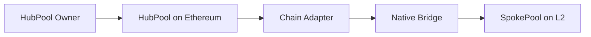

Across Protocol uses the UUPS (Universal Upgradeable Proxy Standard) pattern for upgradeability. This guide covers how to upgrade SpokePool contracts via cross-chain governance from the HubPool.

## Understanding UUPS Upgradeability

SpokePool contracts are [UUPSUpgradeable](https://github.com/OpenZeppelin/openzeppelin-contracts-upgradeable/blob/master/contracts/proxy/utils/UUPSUpgradeable.sol) proxy contracts:

- **Proxy address remains constant** - Users always interact with the same address
- **Implementation can be changed** - Logic contracts can be upgraded without changing the proxy
- **Upgrade logic lives in implementation** - Unlike Transparent Proxies, upgrade function is in the implementation contract

<Note>
The UUPS pattern provides gas savings over Transparent Proxy pattern and prevents accidental upgrades via admin calls to implementation contracts.
</Note>

## Cross-Chain Ownership Model

All SpokePools have **cross-chain ownership**:



- **HubPool owns all SpokePools** - The HubPool contract on Ethereum L1 is the admin of all L2/sidechain SpokePools
- **Chain adapters relay messages** - Each chain has a specialized adapter that uses the native bridge to relay admin calls
- **Per-chain admin verification** - Each SpokePool variant implements `_requireAdminSender()` to verify the caller using chain-specific logic

### Admin Verification Examples

<CodeGroup>

```solidity Arbitrum
// Arbitrum_SpokePool.sol
function _requireAdminSender() internal view override {
    address l1Addr = msg.sender.toL1Addr();  // Reverse address aliasing
    require(l1Addr == crossDomainAdmin, "Not admin");
}
```

```solidity Optimism
// Ovm_SpokePool.sol
function _requireAdminSender() internal view override {
    require(
        msg.sender == address(MESSENGER) && 
        MESSENGER.xDomainMessageSender() == crossDomainAdmin,
        "Not admin"
    );
}
```

```solidity Polygon
// Polygon_SpokePool.sol
function _requireAdminSender() internal view override {
    require(
        msg.sender == address(fxChild) &&
        fxChild.xDomainMessageSender() == crossDomainAdmin,
        "Not admin"
    );
}
```

</CodeGroup>

## Upgrade Process

Upgrading a SpokePool involves several steps, from deploying a new implementation to executing the upgrade via HubPool.

### 1. Deploy New Implementation

<Steps>
  <Step title="Deploy the new implementation contract">
    Deploy a new implementation without upgrading the proxy:

    ```bash
    forge script script/DeployArbitrumSpokePool.s.sol:DeployArbitrumSpokePool \
      --rpc-url arbitrum \
      --broadcast \
      --verify \
      -vvvv
    ```

    Save the new implementation address from the deployment output.
  </Step>

  <Step title="Test the implementation">
    Before upgrading, thoroughly test the new implementation:
    - Run all test suites
    - Perform fork tests against mainnet state
    - Verify storage layout compatibility
    - Check for breaking changes
  </Step>
</Steps>

### 2. Generate Upgrade Calldata

Use the upgrade script to generate calldata for the HubPool:

```bash
forge script script/tasks/UpgradeSpokePool.s.sol:UpgradeSpokePool \
  --sig "run(address)" <NEW_IMPLEMENTATION_ADDRESS> \
  -vvvv
```

This script generates calldata that:

1. **Upgrades to the new implementation** via `upgradeToAndCall()`
2. **Pauses deposits** to verify the upgrade succeeded
3. **Unpauses deposits** to confirm the proxy correctly delegates to the new implementation

<Note>
The pause/unpause sequence is a safety mechanism. If the new implementation is broken, the upgrade will revert atomically during the unpause call.
</Note>

### Example Output

```bash
=======================================================
SpokePool Upgrade Calldata Generator
=======================================================

New Implementation Address: 0x1234...5678

To upgrade a SpokePool on chain <chainId>:
Call relaySpokePoolAdminFunction() on the HubPool with:
  - chainId: 42161
  - calldata: 0x4f1ef286000000000000000000000000...

=======================================================
```

### 3. Execute Cross-Chain Upgrade

<Steps>
  <Step title="Call HubPool.relaySpokePoolAdminFunction()">
    The HubPool owner calls `relaySpokePoolAdminFunction()` with:

    ```solidity
    function relaySpokePoolAdminFunction(
        uint256 chainId,
        bytes memory message
    ) external onlyOwner
    ```

    Parameters:
    - `chainId`: Target chain ID (e.g., `42161` for Arbitrum)
    - `message`: Calldata from the upgrade script
  </Step>

  <Step title="HubPool relays message via adapter">
    The HubPool:
    1. Identifies the appropriate chain adapter for the target chain
    2. Calls the adapter via `delegatecall`
    3. Adapter bridges the message using the native bridge (e.g., Arbitrum Inbox, OP Messenger)
  </Step>

  <Step title="Message executes on destination chain">
    After the bridge delay:
    1. Message arrives at the SpokePool
    2. `_requireAdminSender()` verifies the caller
    3. `upgradeToAndCall()` executes, upgrading the implementation
    4. Post-upgrade multicall runs (pause/unpause)
  </Step>

  <Step title="Verify the upgrade">
    Check that the upgrade succeeded:

    ```bash
    # Check implementation address
    cast call $SPOKE_POOL "implementation()" --rpc-url arbitrum

    # Verify deposits are not paused
    cast call $SPOKE_POOL "pausedDeposits()" --rpc-url arbitrum

    # Test a small deposit
    cast send $SPOKE_POOL "depositV3(...) " --rpc-url arbitrum
    ```
  </Step>
</Steps>

## Upgrade Script Deep Dive

The upgrade script generates safe upgrade calldata:

```solidity
// script/tasks/UpgradeSpokePool.s.sol
contract UpgradeSpokePool is Script {
    function run(address implementation) external view {
        // Create multicall data to verify upgrade succeeded
        bytes[] memory multicallData = new bytes[](2);
        multicallData[0] = abi.encodeWithSelector(
            ISpokePoolUpgradeable.pauseDeposits.selector, 
            true
        );
        multicallData[1] = abi.encodeWithSelector(
            ISpokePoolUpgradeable.pauseDeposits.selector, 
            false
        );

        // Encode multicall as initialization data
        bytes memory data = abi.encodeWithSelector(
            ISpokePoolUpgradeable.multicall.selector, 
            multicallData
        );

        // Generate upgradeToAndCall calldata
        bytes memory calldata_ = abi.encodeWithSelector(
            ISpokePoolUpgradeable.upgradeToAndCall.selector,
            implementation,
            data
        );

        console.logBytes(calldata_);
    }
}
```

### Why Pause/Unpause?

The pause/unpause sequence ensures:

- **The upgrade succeeds** - If the new implementation is incompatible, the multicall reverts
- **The proxy delegates correctly** - The unpause call proves the proxy routes calls to the new implementation
- **Atomicity** - The entire upgrade reverts if any step fails

<Warning>
If the upgrade fails, the transaction reverts and the SpokePool remains on the old implementation. No partial upgrade is possible.
</Warning>

## Solana/SVM Upgrades

Solana program upgrades follow a different process:

### 1. Write Upgrade Buffer

```bash
export PROGRAM=svm_spoke
export PROGRAM_ID=$(cat target/idl/$PROGRAM.json | jq -r ".address")
export RPC_URL=https://api.mainnet-beta.solana.com
export KEYPAIR=~/.config/solana/id.json

# Build verified binary
unset IS_TEST
yarn build-svm-solana-verify

# Write to buffer
solana program write-buffer \
  --url $RPC_URL \
  --keypair $KEYPAIR \
  --with-compute-unit-price 100000 \
  --max-sign-attempts 100 \
  --use-rpc \
  target/deploy/$PROGRAM.so
```

Save the buffer address from the output.

### 2. Transfer Buffer Authority

```bash
export BUFFER=<BUFFER_ADDRESS_FROM_ABOVE>
export MULTISIG=<YOUR_SQUADS_VAULT>

solana program set-buffer-authority \
  --url $RPC_URL \
  --keypair $KEYPAIR \
  $BUFFER \
  --new-buffer-authority $MULTISIG
```

### 3. Execute via Squads Multisig

<Steps>
  <Step title="Add program to Squads">
    In Squads UI (`https://app.squads.so/`):
    1. Go to **Developers** → **Programs**
    2. Add your program ID
  </Step>

  <Step title="Create upgrade transaction">
    1. Click **Upgrade**
    2. Fill in buffer address and refund recipient
    3. Verify buffer authority (prompted)
    4. Submit upgrade proposal
  </Step>

  <Step title="Sign and execute">
    1. All required signers approve
    2. Execute the upgrade from the transactions section
  </Step>
</Steps>

### 4. Upgrade IDL

After upgrading the program, update the IDL:

```bash
# Write IDL to buffer
anchor idl write-buffer \
  --provider.cluster $RPC_URL \
  --provider.wallet $KEYPAIR \
  --filepath target/idl/$PROGRAM.json \
  $PROGRAM_ID

export IDL_BUFFER=<IDL_BUFFER_ADDRESS>

# Transfer authority
anchor idl set-authority \
  --provider.cluster $RPC_URL \
  --provider.wallet $KEYPAIR \
  --program-id $PROGRAM_ID \
  --new-authority $MULTISIG \
  $IDL_BUFFER

# Generate multisig transaction
anchor run squadsIdlUpgrade -- \
  --programId $PROGRAM_ID \
  --idlBuffer $IDL_BUFFER \
  --multisig $MULTISIG \
  --closeRecipient $(solana address --keypair $KEYPAIR)
```

Import the printed base58 transaction into Squads for approval and execution.

## Safety Checklist

Before upgrading:

- [ ] **Test extensively** - Run full test suite and fork tests
- [ ] **Check storage layout** - Verify no storage collisions with Foundry's `forge inspect`
- [ ] **Audit changes** - Review all code changes since last upgrade
- [ ] **Verify implementation** - Use the verification guide to verify the new implementation on block explorers
- [ ] **Test on testnet first** - Always upgrade testnet deployments before mainnet
- [ ] **Coordinate with relayers** - Notify relayers of upgrade schedule
- [ ] **Monitor after upgrade** - Watch for errors in the first hour post-upgrade
- [ ] **Have rollback plan** - Be prepared to upgrade to previous implementation if issues arise

<Warning>
UUPS upgrades are one-way. Once upgraded, you can only "rollback" by deploying the old implementation again as a new upgrade. There is no built-in rollback mechanism.
</Warning>

## Troubleshooting

### Upgrade reverts with "Not admin"

The cross-chain message is not properly authenticated. Check:
- HubPool address matches `crossDomainAdmin` on SpokePool
- Chain adapter is correctly configured for the target chain
- Native bridge is functioning (not paused/disabled)

### Upgrade succeeds but contract is broken

This should not happen if the pause/unpause verification is working. If it does:
1. Immediately prepare a rollback upgrade
2. Test rollback implementation thoroughly
3. Execute rollback upgrade ASAP
4. Investigate why the verification didn't catch the issue

### IDL upgrade fails on Solana

Verify:
- IDL buffer authority is set to multisig
- Program ID is correct
- Squads transaction was constructed properly
- All signers have approved

## Next Steps

- Learn about [contract verification](/guides/verification) to verify upgraded implementations
- Review [HubPool contract](/contracts/hubpool) details
- Understand [chain adapters](/contracts/adapters/overview) used for cross-chain messages