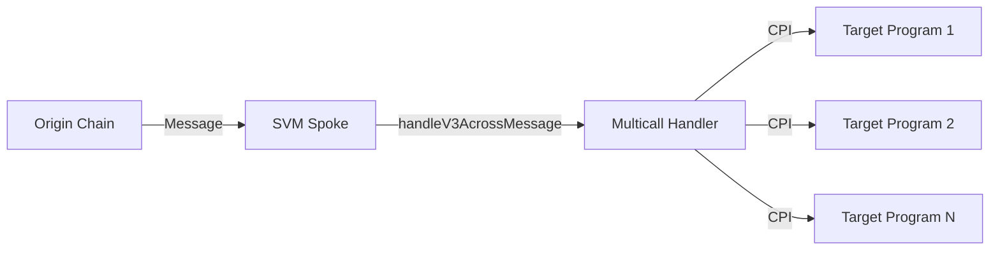

## Overview

The `multicall_handler` program provides a secure way to execute arbitrary batched instructions on Solana via Across cross-chain messages. It acts as a message receiver that deserializes and executes compiled instructions sent from other chains.

**Program ID**: `HaQe51FWtnmaEcuYEfPA7MRCXKrtqptat4oJdJ8zV5Be`

## Purpose

When users bridge tokens to Solana with an attached message, the `multicall_handler` enables:

- **Arbitrary execution** - Execute any Solana instruction as part of the bridge
- **Batched operations** - Multiple instructions in a single cross-chain message
- **Composability** - Interact with any Solana program after receiving bridged funds
- **Handler signing** - Optional PDA signer for permissioned operations

## Architecture



The handler receives serialized instructions from the SVM Spoke program and executes them as Cross-Program Invocations (CPIs).

## Implementation

### Program Structure

```rust
#[program]
pub mod multicall_handler {
    use super::*;

    /// Handler to receive Across message formatted as serialized compiled instructions.
    /// When deserialized, these are matched with the passed accounts and executed as CPIs.
    pub fn handle_v3_across_message(
        ctx: Context<HandleV3AcrossMessage>,
        message: Vec<u8>
    ) -> Result<()> {
        // Derive handler signer PDA
        let (handler_signer, bump) = Pubkey::find_program_address(
            &[b"handler_signer"],
            &crate::ID
        );

        // Deserialize compiled instructions from message
        let compiled_ixs: Vec<CompiledIx> = 
            AnchorDeserialize::deserialize(&mut &message[..])?;

        for compiled_ix in compiled_ixs {
            let mut use_handler_signer = false;
            let mut accounts = Vec::new();
            let mut account_infos = Vec::new();

            // Get target program from remaining accounts
            let target_program = ctx
                .remaining_accounts
                .get(compiled_ix.program_id_index as usize)
                .ok_or(ErrorCode::AccountNotEnoughKeys)?;

            // Resolve CPI accounts from indexed references
            for index in compiled_ix.account_key_indexes {
                let account_info = ctx
                    .remaining_accounts
                    .get(index as usize)
                    .ok_or(ErrorCode::AccountNotEnoughKeys)?;
                
                let is_handler_signer = account_info.key() == handler_signer;
                use_handler_signer |= is_handler_signer;

                match account_info.is_writable {
                    true => accounts.push(AccountMeta::new(
                        account_info.key(),
                        is_handler_signer
                    )),
                    false => accounts.push(AccountMeta::new_readonly(
                        account_info.key(),
                        is_handler_signer
                    )),
                }
                account_infos.push(account_info.to_owned());
            }

            let cpi_instruction = Instruction {
                program_id: target_program.key(),
                accounts,
                data: compiled_ix.data
            };

            // Execute with or without handler signer
            match use_handler_signer {
                true => invoke_signed(
                    &cpi_instruction,
                    &account_infos,
                    &[&[b"handler_signer", &[bump]]]
                )?,
                false => invoke(&cpi_instruction, &account_infos)?,
            }
        }

        Ok(())
    }
}
```

### Compiled Instruction Format

```rust
#[derive(AnchorDeserialize)]
pub struct CompiledIx {
    pub program_id_index: u8,       // Index into remaining_accounts for target program
    pub account_key_indexes: Vec<u8>, // Indexes into remaining_accounts for instruction accounts
    pub data: Vec<u8>,              // Instruction data bytes
}
```

### Handler Signer PDA

The handler maintains a PDA that can sign CPIs:

**Seeds**: `["handler_signer"]`  
**Bump**: 255 (optimized for compute efficiency)

This PDA can be included as a signer in any instruction executed by the handler, enabling permissioned operations.

## Usage Example

### Creating a Cross-Chain Message

On the origin chain (e.g., Ethereum), encode Solana instructions into the message field:

```typescript
import { PublicKey, TransactionInstruction } from "@solana/web3.js";
import { AnchorProvider } from "@coral-xyz/anchor";

// Define target instructions on Solana
const instruction1 = new TransactionInstruction({
  programId: splTokenProgram,
  keys: [
    { pubkey: recipientATA, isSigner: false, isWritable: true },
    { pubkey: mintAddress, isSigner: false, isWritable: false },
    // ...
  ],
  data: Buffer.from([/* instruction data */]),
});

const instruction2 = new TransactionInstruction({
  programId: dexProgram,
  keys: [
    // ...
  ],
  data: Buffer.from([/* swap data */]),
});

// Compile instructions into message format
function compileInstructions(
  instructions: TransactionInstruction[],
  allAccounts: PublicKey[]
): Buffer {
  const compiledIxs = instructions.map(ix => {
    // Build account index map
    const accountIndexes = ix.keys.map(key => 
      allAccounts.findIndex(acc => acc.equals(key.pubkey))
    );
    
    const programIndex = allAccounts.findIndex(acc => 
      acc.equals(ix.programId)
    );

    return {
      program_id_index: programIndex,
      account_key_indexes: accountIndexes,
      data: Array.from(ix.data),
    };
  });

  // Serialize using Anchor's borsh encoding
  return borsh.serialize(compiledIxsSchema, compiledIxs);
}

const allAccounts = [
  splTokenProgram,
  dexProgram,
  recipientATA,
  mintAddress,
  // ... all unique accounts
];

const messageBytes = compileInstructions(
  [instruction1, instruction2],
  allAccounts
);

// Include in Across deposit
await spokePool.deposit(
  recipient, // Multicall handler on Solana
  inputToken,
  outputToken,
  inputAmount,
  outputAmount,
  destinationChainId, // Solana
  exclusiveRelayer,
  quoteTimestamp,
  fillDeadline,
  exclusivityDeadline,
  messageBytes // Encoded instructions
);
```

### Executing on Solana

When the relayer fills the deposit on Solana with the message:

```typescript
import { Program } from "@coral-xyz/anchor";
import { MulticallHandler } from "./target/types/multicall_handler";

const multicallHandler = anchor.workspace.MulticallHandler as Program<MulticallHandler>;

// SVM Spoke will call this during fill
await multicallHandler.methods
  .handleV3AcrossMessage(messageBytes)
  .remainingAccounts([
    // All accounts referenced in compiled instructions
    { pubkey: splTokenProgram, isSigner: false, isWritable: false },
    { pubkey: dexProgram, isSigner: false, isWritable: false },
    { pubkey: recipientATA, isSigner: false, isWritable: true },
    { pubkey: mintAddress, isSigner: false, isWritable: false },
    // ...
  ])
  .rpc();
```

## Use Cases

### 1. Token Swap After Bridge

Bridge USDC to Solana and immediately swap to another token:

```
1. Receive USDC via fill
2. Execute Jupiter swap instruction
3. Deliver final token to recipient
```

### 2. DeFi Interaction

Bridge and deposit into yield protocol:

```
1. Receive token via fill
2. Execute deposit to Marinade/Lido
3. Transfer receipt token to recipient
```

### 3. NFT Minting

Bridge payment and mint NFT:

```
1. Receive SOL/USDC via fill
2. Execute NFT mint instruction
3. Transfer NFT to recipient
```

### 4. Multi-Step Operations

Complex multi-instruction flows:

```
1. Receive token via fill
2. Split to multiple ATAs
3. Execute multiple DeFi operations
4. Aggregate results
5. Deliver to final recipient
```

## Security Considerations

### Handler Signer PDA

The `handler_signer` PDA can sign arbitrary instructions. Programs accepting this PDA as a signer should:

- Validate the PDA derivation
- Implement proper authorization checks
- Not grant unlimited privileges

### Account Validation

The handler does **not** validate:

- Target program IDs
- Account ownership
- Instruction data validity

All validation must be done by the target programs receiving CPIs.

### Message Size Limits

Solana transactions have a 1232 byte limit. Complex multi-instruction messages may hit this limit. Consider:

- Minimizing instruction count
- Using compact instruction data
- Splitting across multiple deposits if needed

### Reentrancy

The handler executes instructions sequentially. Each instruction can potentially call back into the handler, but:

- The handler has no state to corrupt
- Target programs must implement their own reentrancy guards
- Standard Solana CPI rules apply

## Deployment

### Build

```bash
unset IS_TEST
yarn build-svm-solana-verify
yarn generate-svm-artifacts
```

### Deploy

```bash
export RPC_URL=https://api.mainnet-beta.solana.com
export KEYPAIR=~/.config/solana/deployer.json
export PROGRAM=multicall_handler
export PROGRAM_ID=$(cat target/idl/$PROGRAM.json | jq -r ".address")
export MULTISIG=<squads_vault_address>
export MAX_LEN=$(( 2 * $(stat -c %s target/deploy/$PROGRAM.so) ))

# Deploy program
solana program deploy \
  --url $RPC_URL \
  --keypair $KEYPAIR \
  --program-id target/deploy/$PROGRAM-keypair.json \
  --max-len $MAX_LEN \
  --with-compute-unit-price 100000 \
  --max-sign-attempts 100 \
  --use-rpc \
  target/deploy/$PROGRAM.so

# Transfer upgrade authority
solana program set-upgrade-authority \
  --url $RPC_URL \
  --keypair $KEYPAIR \
  --skip-new-upgrade-authority-signer-check \
  $PROGRAM_ID \
  --new-upgrade-authority $MULTISIG

# Upload IDL
anchor idl init \
  --provider.cluster $RPC_URL \
  --provider.wallet $KEYPAIR \
  --filepath target/idl/$PROGRAM.json \
  $PROGRAM_ID

anchor idl set-authority \
  --provider.cluster $RPC_URL \
  --provider.wallet $KEYPAIR \
  --program-id $PROGRAM_ID \
  --new-authority $MULTISIG
```

### Verification

```bash
export SOLANA_VERSION=$(grep -A 2 'name = "solana-program"' Cargo.lock | grep 'version' | head -n 1 | cut -d'"' -f2)

solana-verify verify-from-repo \
  --url $RPC_URL \
  --program-id $PROGRAM_ID \
  --library-name $PROGRAM \
  --base-image "solanafoundation/solana-verifiable-build:$SOLANA_VERSION" \
  https://github.com/across-protocol/contracts
```

## Testing

```typescript
import * as anchor from "@coral-xyz/anchor";
import { Program } from "@coral-xyz/anchor";
import { MulticallHandler } from "../target/types/multicall_handler";

describe("multicall_handler", () => {
  const provider = anchor.AnchorProvider.env();
  anchor.setProvider(provider);

  const program = anchor.workspace.MulticallHandler as Program<MulticallHandler>;

  it("Executes single instruction", async () => {
    // Create test instruction
    const testIx = new TransactionInstruction({
      programId: SystemProgram.programId,
      keys: [
        { pubkey: provider.wallet.publicKey, isSigner: true, isWritable: true },
        { pubkey: recipient, isSigner: false, isWritable: true },
      ],
      data: Buffer.from([2, 0, 0, 0, ...]), // Transfer instruction
    });

    // Compile and execute
    const message = compileInstructions([testIx], allAccounts);
    
    await program.methods
      .handleV3AcrossMessage(message)
      .remainingAccounts(accountMetas)
      .rpc();

    // Verify execution
    // ...
  });

  it("Executes multiple instructions", async () => {
    // ...
  });

  it("Uses handler signer PDA", async () => {
    // ...
  });
});
```

## Optimization

### Handler Signer Bump

The program ID is chosen such that the `handler_signer` PDA has a bump of 255:

```rust
let (handler_signer, bump) = Pubkey::find_program_address(
    &[b"handler_signer"],
    &crate::ID
);
assert_eq!(bump, 255); // Optimal bump minimizes compute cost
```

This maximizes compute efficiency when deriving the PDA on every instruction execution.

### Account Indexing

Instructions reference accounts by index rather than full pubkeys, reducing message size:

```rust
pub struct CompiledIx {
    pub program_id_index: u8,        // 1 byte vs 32 bytes for Pubkey
    pub account_key_indexes: Vec<u8>, // 1 byte per account vs 32
    pub data: Vec<u8>,
}
```

## Integration with SVM Spoke

The SVM Spoke program automatically calls the handler when a fill includes a message:

```rust
// In svm_spoke fill_relay instruction
if !relay_data.message.is_empty() {
    // Invoke multicall handler
    invoke(
        &Instruction {
            program_id: MULTICALL_HANDLER_ID,
            accounts: vec![
                AccountMeta::new_readonly(recipient, false),
            ],
            data: relay_data.message.clone(),
        },
        &[/* accounts */],
    )?;
}
```

The handler recipient must match the `recipient` field in the deposit.

## Limitations

1. **No state** - Handler is stateless, cannot persist data between calls
2. **No validation** - Handler does not validate instructions or accounts
3. **Size limits** - Subject to Solana transaction size limits
4. **Sync execution** - Instructions execute sequentially, not in parallel
5. **Error handling** - Any instruction failure reverts entire transaction

## Resources

<CardGroup cols={2}>
  <Card title="Source Code" icon="github" href="https://github.com/across-protocol/contracts/tree/master/programs/multicall-handler">
    View on GitHub
  </Card>
  <Card title="Solana CPI Guide" icon="book" href="https://docs.solana.com/developing/programming-model/calling-between-programs">
    Learn about Cross-Program Invocation
  </Card>
  <Card title="Transaction Limits" icon="chart-line" href="https://docs.solana.com/developing/programming-model/transactions#transaction-size">
    Solana transaction constraints
  </Card>
  <Card title="Bug Bounty" icon="bug" href="https://docs.across.to/resources/bug-bounty">
    Report security issues
  </Card>
</CardGroup>
