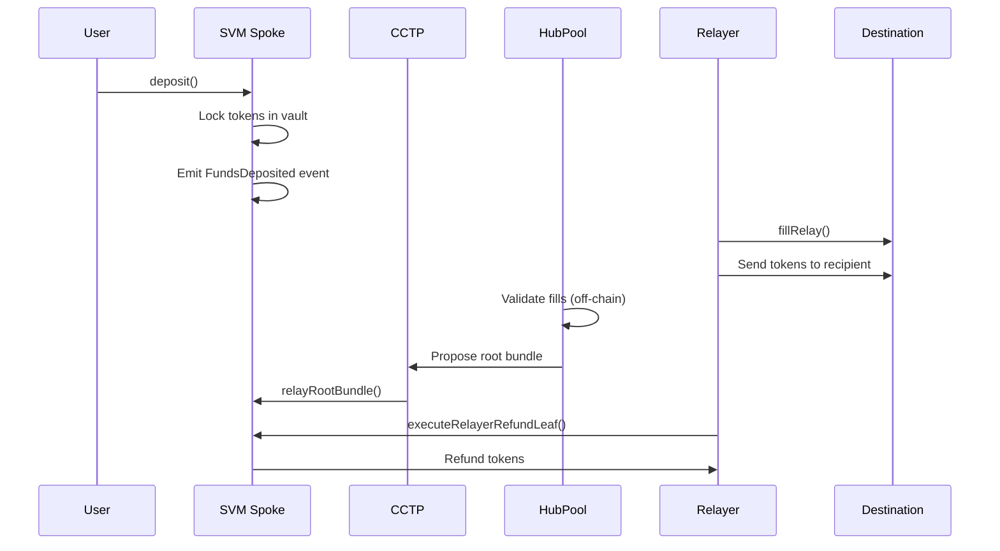

## Overview

Across Protocol extends its cross-chain bridging capabilities to Solana through a suite of Solana Virtual Machine (SVM) programs. These programs enable fast, secure token transfers between Solana and other blockchain networks, leveraging Circle's Cross-Chain Transfer Protocol (CCTP) for message and token bridging.

## Architecture

The Solana integration follows Across's hub-and-spoke model:

- **HubPool** (Ethereum L1) - Central contract managing liquidity and coordinating cross-chain operations
- **SVM Spoke** (Solana) - Main spoke pool program handling deposits, fills, and bundle execution
- **Supporting Programs** - Peripheral programs for enhanced functionality

### Key Components

<CardGroup cols={2}>
  <Card title="SVM Spoke" icon="code" href="/solana/svm-spoke">
    Core spoke pool program for deposits, fills, and relayer refunds
  </Card>
  <Card title="Multicall Handler" icon="layer-group" href="/solana/multicall-handler">
    Executes batched cross-chain messages and instructions
  </Card>
  <Card title="Sponsored CCTP" icon="dollar-sign" href="/solana/sponsored-cctp">
    Sponsored deposit flow using CCTP for token bridging
  </Card>
</CardGroup>

## Technology Stack

### Anchor Framework

All Solana programs are built using the [Anchor framework](https://www.anchor-lang.com/), which provides:

- **Type safety** - Strongly typed Rust interfaces
- **Account validation** - Automatic account constraint checking
- **IDL generation** - Interface Definition Language for client integration
- **Testing utilities** - Comprehensive testing framework

### CCTP Integration

Circle's Cross-Chain Transfer Protocol (CCTP) enables:

- **Native USDC transfers** - Burn tokens on source chain, mint on destination
- **Message passing** - Cross-chain communication between L1 and Solana
- **Attestation service** - Secure validation of cross-chain messages

## Protocol Flow



### Step-by-Step

1. **Deposit** - User locks tokens on Solana via `deposit()` instruction
2. **Fill** - Relayer fulfills deposit on destination chain, fronting capital
3. **Bundling** - Data worker aggregates fills into merkle tree bundles
4. **Relay** - HubPool relays root bundle to Solana via CCTP
5. **Execution** - Root bundle executed to process refunds and rebalances
6. **Refund** - Relayer claims refund using merkle proof

## Key Features

### Deposits

- **Standard deposits** - `deposit()` with auto-incrementing nonce
- **Deposit now** - `deposit_now()` with automatic quote timestamp
- **Unsafe deposits** - `unsafe_deposit()` for deterministic deposit IDs
- **Message passing** - Attach arbitrary data for destination contract calls

### Fills

- **Fast fills** - Relayers compete to fill deposits instantly
- **Slow fills** - Fallback mechanism using protocol reserves
- **Exclusivity periods** - Optional exclusive relayer windows
- **Cross-chain refunds** - Relayers choose refund destination chain

### Admin Functions

- **Pausable** - Emergency pause for deposits and fills
- **Upgradeable** - Cross-chain ownership via HubPool
- **Bundle management** - Root bundle relay and execution
- **Emergency deletion** - Remove invalid bundles

## Development Setup

### Prerequisites

```bash
# Install Anchor
cargo install --git https://github.com/coral-xyz/anchor avm --locked --force
avm install latest
avm use latest

# Install Solana CLI
sh -c "$(curl -sSfL https://release.solana.com/stable/install)"
```

### Build Programs

```bash
# Build all SVM programs (local toolchain)
yarn build

# Build with verified Docker images
yarn build-verified

# Generate TypeScript artifacts
yarn generate-svm-artifacts
```

### Testing

```bash
# Run all SVM tests
yarn test-svm

# Run with verified build
yarn test-svm-solana-verify

# Lint Rust code
yarn lint-rust
```

## Deployment

See individual program pages for detailed deployment instructions:

- [SVM Spoke Deployment](/solana/svm-spoke#deployment)
- [Multicall Handler Deployment](/solana/multicall-handler#deployment)
- [Sponsored CCTP Deployment](/solana/sponsored-cctp#deployment)

For complete deployment procedures, see the [main README](https://github.com/across-protocol/contracts#svm).

## Network Information

### Mainnet

- **Chain ID**: Computed via `cast to-dec $(cast shr $(cast keccak solana-mainnet) 208) 208)`
- **RPC**: `https://api.mainnet-beta.solana.com`
- **CCTP Domain**: 5
- **USDC Mint**: `EPjFWdd5AufqSSqeM2qN1xzybapC8G4wEGGkZwyTDt1v`

### Devnet

- **Chain ID**: Computed via `cast to-dec $(cast shr $(cast keccak solana-devnet) 208) 208)`
- **RPC**: `https://api.devnet.solana.com`
- **USDC Mint**: `4zMMC9srt5Ri5X14GAgXhaHii3GnPAEERYPJgZJDncDU`

## Security

- **Audited by OpenZeppelin** - All programs undergo security audits
- **Bug bounty** - Report issues at bugs@across.to
- **Security policy** - See [https://docs.across.to/resources/bug-bounty](https://docs.across.to/resources/bug-bounty)
- **Verified builds** - Reproducible builds using Solana verifiable build tools

## Resources

<CardGroup cols={2}>
  <Card title="GitHub Repository" icon="github" href="https://github.com/across-protocol/contracts">
    View source code and contribute
  </Card>
  <Card title="Anchor Docs" icon="book" href="https://www.anchor-lang.com/docs">
    Learn about the Anchor framework
  </Card>
  <Card title="CCTP Docs" icon="circle" href="https://developers.circle.com/stablecoins/docs/cctp-getting-started">
    Circle's Cross-Chain Transfer Protocol
  </Card>
  <Card title="Solana Docs" icon="S" href="https://docs.solana.com/">
    Official Solana documentation
  </Card>
</CardGroup>
