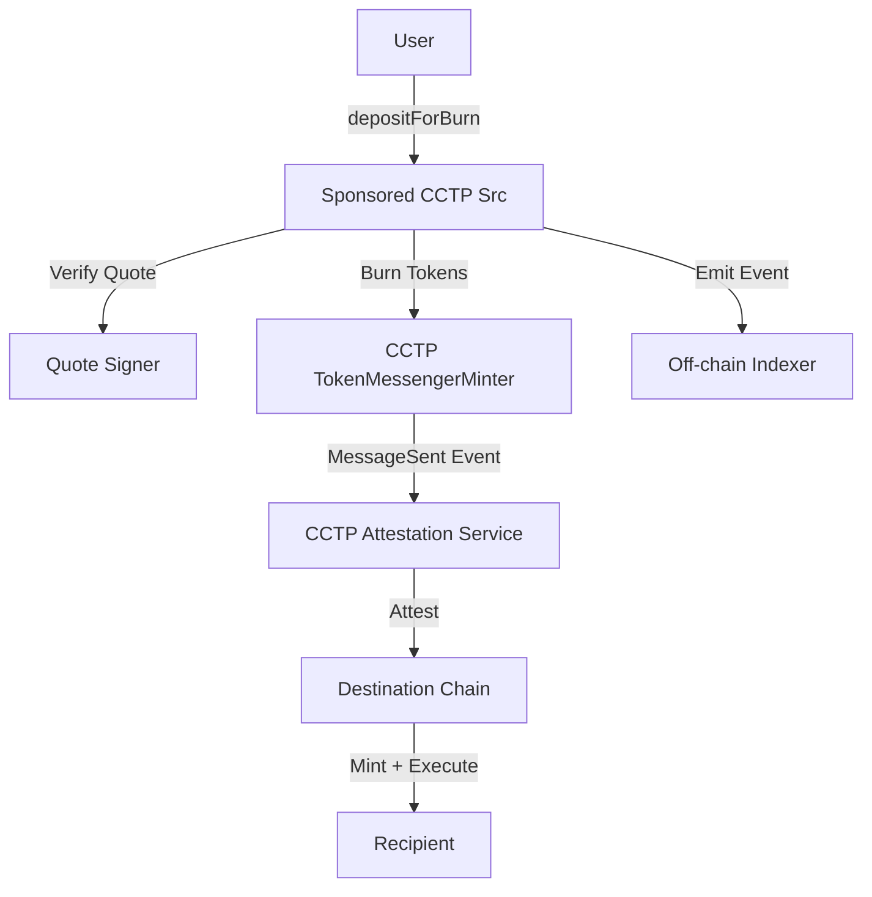

## Overview

The `sponsored_cctp_src_periphery` program is a source chain periphery that enables users to initiate sponsored or non-sponsored cross-chain flows with custom Across-supported destination logic. It uses Circle's CCTP v2 as the underlying bridge mechanism.

**Program ID**: `CPr4bRvkVKcSCLyrQpkZrRrwGzQeVAXutFU8WupuBLXq`

## Purpose

This program enables:

- **Sponsored deposits** - Quote-based deposits where fees are pre-calculated off-chain
- **CCTP bridging** - Native USDC bridging via Circle's protocol
- **Flexible routing** - Support for direct-to-core, arbitrary actions, and swap flows
- **Gasless deposits** - Users pay fees in bridged tokens, not SOL
- **Quote verification** - EVM signature verification for sponsored quotes

## Architecture



## State Management

### Program State

```rust
#[account]
pub struct State {
    pub source_domain: u32,      // CCTP domain for Solana (5)
    pub signer: Pubkey,          // Trusted EVM signer for quote authorization
    pub current_time: u32,       // Test mode only (0 on mainnet)
}
```

**PDA**: `["state"]`

### Minimum Deposit

```rust
#[account]
pub struct MinimumDeposit {
    pub amount: u64,             // Minimum deposit amount for this token
}
```

**PDA**: `["minimum_deposit", burn_token.key()]`

### Used Nonce

```rust
#[account]
pub struct UsedNonce {
    pub nonce: [u8; 32],         // Quote nonce (prevents replay)
    pub deadline: u32,           // Quote expiry timestamp
}
```

**PDA**: `["used_nonce", nonce]`

### Rent Claim

```rust
#[account]
pub struct RentClaim {
    pub amount: u64,             // Lamports owed to user from rent_fund
}
```

**PDA**: `["rent_claim", user.key()]`

### Rent Fund

A system account PDA used to sponsor account creation:

**PDA**: `["rent_fund"]`  
**Bump**: 255 (optimized)

## Core Instructions

### Initialization

```rust
pub fn initialize(
    ctx: Context<Initialize>,
    params: InitializeParams
) -> Result<()>
```

**InitializeParams**:
```rust
pub struct InitializeParams {
    pub source_domain: u32,      // CCTP domain ID (5 for Solana)
    pub signer: Pubkey,          // EVM signer address (as Pubkey)
}
```

Initializes the program state. Only callable once by the upgrade authority.

**Example**:
```bash
anchor run initializeSponsoredCctpSrc \
  --provider.cluster $RPC_URL \
  --provider.wallet $KEYPAIR -- \
  --quoteSigner 0xA1b2C3d4E5f6789012345678901234567890aBcD
```

### Set Quote Signer

```rust
pub fn set_signer(
    ctx: Context<SetSigner>,
    params: SetSignerParams
) -> Result<()>
```

**SetSignerParams**:
```rust
pub struct SetSignerParams {
    pub new_signer: Pubkey,      // New EVM signer address
}
```

Updates the trusted quote signer. Only callable by upgrade authority.

<Warning>
Setting the signer to `Pubkey::default()` or an invalid address will effectively disable all deposits.
</Warning>

### Set Minimum Deposit Amount

```rust
pub fn set_minimum_deposit_amount(
    ctx: Context<SetMinimumDepositAmount>,
    params: SetMinimumDepositAmountParams,
) -> Result<()>
```

**SetMinimumDepositAmountParams**:
```rust
pub struct SetMinimumDepositAmountParams {
    pub amount: u64,             // New minimum deposit amount
}
```

Configures the minimum deposit amount for a burn token. Must be set for each supported token.

**Example**:
```bash
# Set minimum deposit for USDC (0 for testing, higher for production)
anchor run setMinimumDepositSponsoredCctpSrc \
  --provider.cluster $RPC_URL \
  --provider.wallet $KEYPAIR -- \
  --burnToken EPjFWdd5AufqSSqeM2qN1xzybapC8G4wEGGkZwyTDt1v \
  --amount 1000000  # 1 USDC (6 decimals)
```

### Deposit For Burn

```rust
pub fn deposit_for_burn(
    ctx: Context<DepositForBurn>,
    params: DepositForBurnParams
) -> Result<()>
```

**DepositForBurnParams**:
```rust
pub struct DepositForBurnParams {
    pub quote: SponsoredCCTPQuote,  // Quote details
    pub signature: [u8; 65],        // EVM signature (r, s, v)
}
```

**SponsoredCCTPQuote**:
```rust
pub struct SponsoredCCTPQuote {
    pub source_domain: u32,              // CCTP source domain (5)
    pub destination_domain: u32,         // CCTP destination domain
    pub mint_recipient: [u8; 32],        // Recipient on destination (32 bytes)
    pub amount: u64,                     // Amount to burn
    pub burn_token: Pubkey,              // Token to burn (e.g., USDC)
    pub destination_caller: [u8; 32],    // Authorized caller on destination
    pub max_fee: u64,                    // Maximum fee in burn token units
    pub min_finality_threshold: u32,     // Minimum finality before attestation
    pub nonce: [u8; 32],                 // Unique nonce (prevents replay)
    pub deadline: u32,                   // Quote expiry timestamp
    pub max_bps_to_sponsor: u16,         // Max basis points to sponsor
    pub max_user_slippage_bps: u16,      // User's slippage tolerance
    pub final_recipient: [u8; 32],       // Final recipient address
    pub final_token: [u8; 32],           // Final token after swaps
    pub execution_mode: u8,              // 0=DirectToCore, 1=ArbitraryToCore, 2=ArbitraryToEVM
    pub action_data: Vec<u8>,            // Encoded action data
}
```

Verifies a sponsored quote, records its nonce, and burns tokens via CCTP.

#### Execution Modes

1. **DirectToCore (0)** - Direct deposit to Across with no intermediate actions
2. **ArbitraryActionsToCore (1)** - Execute actions then deposit to Across
3. **ArbitraryActionsToEVM (2)** - Execute arbitrary EVM actions on destination

**Example**:

```typescript
import { Program, AnchorProvider, BN } from "@coral-xyz/anchor";
import { SponsoredCctpSrcPeriphery } from "./target/types/sponsored_cctp_src_periphery";
import { Keypair, PublicKey } from "@solana/web3.js";
import { ethers } from "ethers";

const program = anchor.workspace.SponsoredCctpSrcPeriphery as Program<SponsoredCctpSrcPeriphery>;

// Step 1: Get quote from off-chain service
const quote = {
  sourceDomain: 5, // Solana
  destinationDomain: 0, // Ethereum
  mintRecipient: ethers.utils.arrayify(recipientAddress),
  amount: new BN(1_000_000), // 1 USDC
  burnToken: usdcMint,
  destinationCaller: ethers.utils.arrayify("0x..."),
  maxFee: new BN(10_000), // 0.01 USDC fee
  minFinalityThreshold: 1,
  nonce: randomBytes32(),
  deadline: Math.floor(Date.now() / 1000) + 3600, // 1 hour
  maxBpsToSponsor: 100, // 1%
  maxUserSlippageBps: 50, // 0.5%
  finalRecipient: ethers.utils.arrayify(finalRecipient),
  finalToken: ethers.utils.arrayify(finalTokenAddress),
  executionMode: 0, // DirectToCore
  actionData: [],
};

// Step 2: Get EVM signature from trusted signer
const signature = await getQuoteSignature(quote); // Off-chain signing

// Step 3: Execute deposit
const [statePDA] = PublicKey.findProgramAddressSync(
  [Buffer.from("state")],
  program.programId
);

const [rentFundPDA] = PublicKey.findProgramAddressSync(
  [Buffer.from("rent_fund")],
  program.programId
);

const [usedNoncePDA] = PublicKey.findProgramAddressSync(
  [Buffer.from("used_nonce"), quote.nonce],
  program.programId
);

const [minimumDepositPDA] = PublicKey.findProgramAddressSync(
  [Buffer.from("minimum_deposit"), usdcMint.toBuffer()],
  program.programId
);

const messageSentEventData = Keypair.generate();

await program.methods
  .depositForBurn({ quote, signature })
  .accounts({
    signer: user.publicKey,
    state: statePDA,
    rentFund: rentFundPDA,
    minimumDeposit: minimumDepositPDA,
    usedNonce: usedNoncePDA,
    depositorTokenAccount: userUsdcATA,
    burnToken: usdcMint,
    messageSentEventData: messageSentEventData.publicKey,
    // ... CCTP accounts
  })
  .signers([messageSentEventData])
  .rpc();
```

### Reclaim Event Account

```rust
pub fn reclaim_event_account(
    ctx: Context<ReclaimEventAccount>,
    params: ReclaimEventAccountParams
) -> Result<()>
```

**ReclaimEventAccountParams**:
```rust
pub struct ReclaimEventAccountParams {
    pub attestation: Vec<u8>,            // CCTP attestation
    pub nonce: [u8; 32],                 // Message nonce
    pub finality_threshold_executed: u32, // Finality threshold
    pub fee_executed: [u8; 32],          // Fee amount (uint256 BE)
    pub expiration_block: [u8; 32],      // Expiration block (uint256 BE)
}
```

Reclaims rent from CCTP `MessageSent` event accounts after attestation. Returns lamports to `rent_fund`.

**Timing**:
- Must wait for CCTP attestation service to process the message
- Minimum time window defined by `EVENT_ACCOUNT_WINDOW_SECONDS` in CCTP program
- Track closable accounts via `CreatedEventAccount` events

### Reclaim Used Nonce Account

```rust
pub fn reclaim_used_nonce_account(
    ctx: Context<ReclaimUsedNonceAccount>,
    params: UsedNonceAccountParams,
) -> Result<()>
```

**UsedNonceAccountParams**:
```rust
pub struct UsedNonceAccountParams {
    pub nonce: [u8; 32],                 // Nonce to close
}
```

Closes a `used_nonce` PDA after its quote deadline has passed, returning rent to `rent_fund`.

**Helper Function**:
```rust
pub fn get_used_nonce_close_info(
    ctx: Context<GetUsedNonceCloseInfo>,
    _params: UsedNonceAccountParams,
) -> Result<UsedNonceCloseInfo>
```

Returns:
```rust
pub struct UsedNonceCloseInfo {
    pub can_close_after: u32,            // Timestamp when closable
    pub can_close_now: bool,             // Whether closable now
}
```

### Rent Fund Management

#### Withdraw Rent Fund

```rust
pub fn withdraw_rent_fund(
    ctx: Context<WithdrawRentFund>,
    params: WithdrawRentFundParams
) -> Result<()>
```

**WithdrawRentFundParams**:
```rust
pub struct WithdrawRentFundParams {
    pub amount: u64,                     // Lamports to withdraw
}
```

Withdraws lamports from `rent_fund` to arbitrary recipient. Only callable by upgrade authority.

#### Repay Rent Fund Debt

```rust
pub fn repay_rent_fund_debt(
    ctx: Context<RepayRentFundDebt>
) -> Result<()>
```

Repays rent_fund liability accrued when rent_fund had insufficient balance during a deposit. Closes the `rent_claim` PDA and transfers owed lamports to the user.

## Events

### SponsoredDepositForBurn

Emitted when a sponsored deposit is successfully executed:

```rust
#[event]
pub struct SponsoredDepositForBurn {
    pub burn_token: Pubkey,
    pub amount: u64,
    pub depositor: Pubkey,
    pub mint_recipient: [u8; 32],
    pub destination_domain: u32,
    pub destination_caller: [u8; 32],
    pub max_fee: u64,
    pub quote_nonce: [u8; 32],
    pub quote_deadline: u32,
    pub execution_mode: u8,
    // ... additional fields
}
```

### CreatedEventAccount

Emitted with the address of the CCTP `MessageSent` event account:

```rust
#[event]
pub struct CreatedEventAccount {
    pub event_account: Pubkey,           // Address of MessageSent account
    pub nonce: [u8; 32],                 // Associated message nonce
}
```

## Quote Verification

The program verifies EVM signatures using Solana's `secp256k1_recover` syscall:

```rust
use solana_program::secp256k1_recover::secp256k1_recover;

// Compute EIP-191 message hash
let message_hash = keccak256(
    &[b"\x19Ethereum Signed Message:\n", message_len, &serialized_quote]
);

// Recover signer from signature
let recovered_pubkey = secp256k1_recover(
    &message_hash,
    signature.recovery_id,
    &signature.signature
)?;

// Verify against trusted signer
require!(
    keccak256(&recovered_pubkey)[12..] == state.signer.to_bytes()[..20],
    ErrorCode::InvalidSignature
);
```

## Rent Management

The program requires rent for two types of accounts:

1. **UsedNonce PDAs** - ~100 bytes, closable after quote deadline
2. **CCTP MessageSent accounts** - ~1KB, closable after attestation

The `rent_fund` PDA sponsors these accounts:

- **Sufficient balance** - Normal operation, rent deducted from `rent_fund`
- **Insufficient balance** - Creates `rent_claim` PDA tracking debt to user
- **Reclaim** - Operator closes accounts, returns rent to `rent_fund`
- **Repayment** - User claims owed rent when `rent_fund` is replenished

**Best Practices**:

1. Monitor `rent_fund` balance
2. Track closable accounts via events
3. Regularly reclaim accounts to recover rent
4. Repay users if debt accumulates

## Security Considerations

### Quote Signature Verification

All sponsored deposits require valid EVM signatures:

- **Nonce tracking** - Each nonce can only be used once
- **Deadline enforcement** - Quotes expire after deadline
- **Signer trust** - Only upgrade authority can change signer
- **Replay protection** - Nonces are globally unique

### Minimum Deposit Amounts

Prevents dust attacks and ensures economic viability:

```rust
require!(
    params.quote.amount >= minimum_deposit.amount,
    ErrorCode::DepositTooSmall
);
```

### Upgrade Authority

Critical functions restricted to upgrade authority:

- `initialize()` - One-time setup
- `set_signer()` - Change quote signer
- `set_minimum_deposit_amount()` - Update minimums
- `withdraw_rent_fund()` - Withdraw rent fund

## Deployment

### Build

```bash
unset IS_TEST
yarn build-svm-solana-verify
yarn generate-svm-artifacts
```

### Deploy

```bash
export RPC_URL=https://api.mainnet-beta.solana.com
export KEYPAIR=~/.config/solana/deployer.json
export PROGRAM=sponsored_cctp_src_periphery
export PROGRAM_ID=$(cat target/idl/$PROGRAM.json | jq -r ".address")
export MULTISIG=<squads_vault_address>
export MAX_LEN=$(( 2 * $(stat -c %s target/deploy/$PROGRAM.so) ))

# Deploy
solana program deploy \
  --url $RPC_URL \
  --keypair $KEYPAIR \
  --program-id target/deploy/$PROGRAM-keypair.json \
  --max-len $MAX_LEN \
  --with-compute-unit-price 100000 \
  --max-sign-attempts 100 \
  --use-rpc \
  target/deploy/$PROGRAM.so

# Transfer authority
solana program set-upgrade-authority \
  --url $RPC_URL \
  --keypair $KEYPAIR \
  --skip-new-upgrade-authority-signer-check \
  $PROGRAM_ID \
  --new-upgrade-authority $MULTISIG

# Upload IDL
anchor idl init \
  --provider.cluster $RPC_URL \
  --provider.wallet $KEYPAIR \
  --filepath target/idl/$PROGRAM.json \
  $PROGRAM_ID

anchor idl set-authority \
  --provider.cluster $RPC_URL \
  --provider.wallet $KEYPAIR \
  --program-id $PROGRAM_ID \
  --new-authority $MULTISIG
```

### Initialize

```bash
# Initialize state
anchor run initializeSponsoredCctpSrc \
  --provider.cluster $RPC_URL \
  --provider.wallet $KEYPAIR -- \
  --quoteSigner 0xA1b2C3d4E5f6789012345678901234567890aBcD

# Set minimum deposit for USDC
export USDC_MINT=EPjFWdd5AufqSSqeM2qN1xzybapC8G4wEGGkZwyTDt1v
anchor run setMinimumDepositSponsoredCctpSrc \
  --provider.cluster $RPC_URL \
  --provider.wallet $KEYPAIR -- \
  --burnToken $USDC_MINT \
  --amount 1000000  # 1 USDC minimum

# Fund rent_fund PDA
export RENT_FUND_PDA=$(solana address --program-id $PROGRAM_ID --seed rent_fund)
solana transfer \
  --url $RPC_URL \
  --keypair $KEYPAIR \
  $RENT_FUND_PDA \
  10  # 10 SOL for rent sponsorship
```

## Integration Example

### Off-Chain Quote Service

```typescript
import { ethers } from "ethers";
import { Keypair } from "@solana/web3.js";

// EVM signer private key
const signer = new ethers.Wallet(process.env.QUOTE_SIGNER_KEY!);

async function generateQuote(
  userRequest: DepositRequest
): Promise<{ quote: SponsoredCCTPQuote; signature: Buffer }> {
  // Calculate fees and build quote
  const quote = {
    sourceDomain: 5,
    destinationDomain: userRequest.destinationDomain,
    mintRecipient: ethers.utils.arrayify(userRequest.recipient),
    amount: userRequest.amount,
    burnToken: userRequest.burnToken,
    destinationCaller: ethers.utils.arrayify(userRequest.destinationCaller),
    maxFee: calculateMaxFee(userRequest),
    minFinalityThreshold: 1,
    nonce: crypto.randomBytes(32),
    deadline: Math.floor(Date.now() / 1000) + 3600,
    maxBpsToSponsor: 100,
    maxUserSlippageBps: userRequest.slippageBps,
    finalRecipient: ethers.utils.arrayify(userRequest.finalRecipient),
    finalToken: ethers.utils.arrayify(userRequest.finalToken),
    executionMode: userRequest.executionMode,
    actionData: userRequest.actionData,
  };

  // Serialize quote (Anchor borsh format)
  const serialized = serializeQuote(quote);

  // Sign with EIP-191
  const messageHash = ethers.utils.hashMessage(serialized);
  const sig = await signer.signMessage(serialized);
  const { r, s, v } = ethers.utils.splitSignature(sig);

  // Encode as [r(32), s(32), v(1)]
  const signature = Buffer.concat([
    Buffer.from(r.slice(2), "hex"),
    Buffer.from(s.slice(2), "hex"),
    Buffer.from([v]),
  ]);

  return { quote, signature };
}
```

## Testing

```bash
# Run tests
yarn test-svm

# Test specific scenarios
anchor test --skip-build --skip-deploy -- --grep "sponsored deposit"
```

## Maintenance

### Monitoring

Track events for operational tasks:

```typescript
// Monitor CreatedEventAccount events
program.addEventListener("CreatedEventAccount", async (event) => {
  const { eventAccount, nonce } = event;
  
  // Schedule reclaim after attestation + window
  scheduleReclaim(eventAccount, nonce);
});

// Monitor SponsoredDepositForBurn events
program.addEventListener("SponsoredDepositForBurn", async (event) => {
  const { quoteNonce, quoteDeadline } = event;
  
  // Schedule nonce reclaim after deadline
  scheduleNonceReclaim(quoteNonce, quoteDeadline);
});
```

### Rent Reclamation

```typescript
import { Program } from "@coral-xyz/anchor";

async function reclaimExpiredNonces() {
  const nonces = await getExpiredNonces(); // From indexed events
  
  for (const nonce of nonces) {
    const [usedNoncePDA] = PublicKey.findProgramAddressSync(
      [Buffer.from("used_nonce"), nonce],
      program.programId
    );
    
    // Check if closable
    const info = await program.methods
      .getUsedNonceCloseInfo({ nonce })
      .accounts({ state: statePDA, usedNonce: usedNoncePDA })
      .view();
    
    if (info.canCloseNow) {
      await program.methods
        .reclaimUsedNonceAccount({ nonce })
        .accounts({
          state: statePDA,
          rentFund: rentFundPDA,
          usedNonce: usedNoncePDA,
        })
        .rpc();
    }
  }
}
```

## Resources

<CardGroup cols={2}>
  <Card title="Source Code" icon="github" href="https://github.com/across-protocol/contracts/tree/master/programs/sponsored-cctp-src-periphery">
    View on GitHub
  </Card>
  <Card title="CCTP Documentation" icon="circle" href="https://developers.circle.com/stablecoins/docs/cctp-getting-started">
    Circle CCTP docs
  </Card>
  <Card title="EIP-191" icon="file-contract" href="https://eips.ethereum.org/EIPS/eip-191">
    Signed data standard
  </Card>
  <Card title="Bug Bounty" icon="bug" href="https://docs.across.to/resources/bug-bounty">
    Report security issues
  </Card>
</CardGroup>
